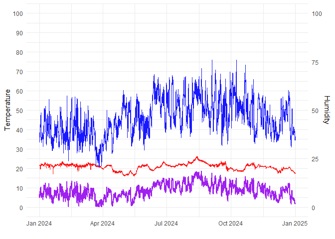
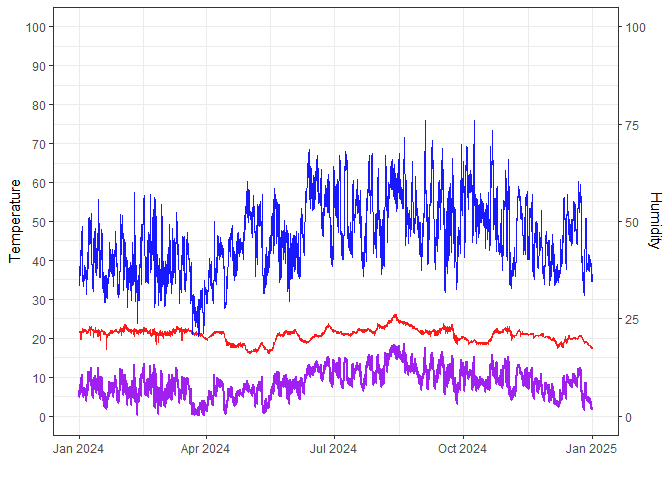

<!-- README.md is generated from README.Rmd. Please edit that file -->

# ConSciR

<!-- badges: start -->
<!-- badges: end -->

ConSciR is an R package specifically designed to assist conservators and
scientists by providing a toolkit for performing calculations and
streamlining common tasks in conservation. ConSciR is designed for:

- Conservators working in museums, galleries, and heritage sites
- Conservation scientists and researchers
- Cultural heritage professionals involved in preventive conservation
- Students and educators in conservation and heritage science programs

Learn more about ConSciR here: [**ConSciR
webpage**](https://bhavshah01.github.io/ConSciR/)

The ConSciR Github page: [**ConSciR
Github**](https://github.com/BhavShah01/ConSciR)

## Tools available

- Calculations: dew point, absolute humidity, water vapour pressure,
  mixing ratio, enthalpy
- Graphs: TRH plots, psychometric chart
- Summaries: percentiles
- Analysis:
- Tidying data:

## Installation

You can install the development version of ConSciR from
[GitHub](https://github.com/) with:

``` r
# install.packages("pak")
pak::pak("BhavShah01/ConSciR")
```

-or-

``` r
# install.packages("devtools")
devtools::install_github("BhavShah01/ConSciR")
```

## Examples

This is a basic example of some commons tasks:

- Load packages

``` r
library(ConSciR)
library(dplyr)
library(ggplot2)
```

- Pre-loaded dataset is availabe for testing

``` r
# My TRH data
head(mydata)
#> # A tibble: 6 × 5
#>   Site   Sensor Date                 Temp    RH
#>   <chr>  <chr>  <dttm>              <dbl> <dbl>
#> 1 London Room 1 2024-01-01 00:00:00  21.8  36.8
#> 2 London Room 1 2024-01-01 00:15:00  21.8  36.7
#> 3 London Room 1 2024-01-01 00:29:59  21.8  36.6
#> 4 London Room 1 2024-01-01 00:44:59  21.7  36.6
#> 5 London Room 1 2024-01-01 00:59:59  21.7  36.5
#> 6 London Room 1 2024-01-01 01:14:59  21.7  36.2
```

- Use functions to perform calculations, for example use the existing
  data to add dew point and absolute humidity. Performance metrics are
  also being added like lifetime multiplier, preservation index and
  mould calculations.

``` r
# Peform calculations
head(mydata) |>
  mutate(
    DewPoint = calcDP(Temp, RH), 
    AbsHum = calcAH(Temp, RH), 
    LifeTime = calcLM(Temp, RH, EA = 100), 
    PreservationIndex = calcPI(Temp, RH))
#> # A tibble: 6 × 9
#>   Site   Sensor Date                 Temp    RH DewPoint AbsHum LifeTime
#>   <chr>  <chr>  <dttm>              <dbl> <dbl>    <dbl>  <dbl>    <dbl>
#> 1 London Room 1 2024-01-01 00:00:00  21.8  36.8     6.41   7.05     1.85
#> 2 London Room 1 2024-01-01 00:15:00  21.8  36.7     6.37   7.03     1.85
#> 3 London Room 1 2024-01-01 00:29:59  21.8  36.6     6.33   7.01     1.85
#> 4 London Room 1 2024-01-01 00:44:59  21.7  36.6     6.24   6.97     1.85
#> 5 London Room 1 2024-01-01 00:59:59  21.7  36.5     6.20   6.95     1.86
#> 6 London Room 1 2024-01-01 01:14:59  21.7  36.2     6.08   6.90     1.86
#> # ℹ 1 more variable: PreservationIndex <dbl>
```

- Graphs

``` r
# Produce graphs 
mydata |>
  graph_TRH()
```



``` r
mydata |>
  mutate(DewPoint = calcDP(Temp, RH)) |>
  graph_TRH() + 
  geom_line(aes(Date, DewPoint), col = "purple", size = 1) + 
  theme_bw()
```


