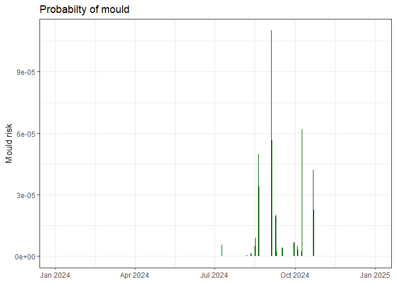

<!-- README.md is generated from README.Rmd. Please edit that file -->

# ConSciR

<!-- badges: start -->
<!-- badges: end -->

ConSciR is an R package designed to assist conservators, scientists and
engineers by providing a toolkit for performing calculations and
streamlining common tasks in cultural heritage conservation. ConSciR is
designed for:

- Conservators working in museums, galleries, and heritage sites
- Conservation scientists, engineers and researchers
- Cultural heritage professionals involved in preventive conservation
- Students and educators in conservation and heritage science programs
- FAIR: ConSciR is designed to be findable, accessible, interoperable
  and reusable

Learn more about ConSciR here: [**ConSciR
webpage**](https://bhavshah01.github.io/ConSciR/)

The ConSciR Github page: [**ConSciR
Github**](https://github.com/BhavShah01/ConSciR)

If using R for the first time, read an article here: [Using R for the
first
time](https://bhavshah01.github.io/ConSciR/articles/ConSciR-FirstTimeR.html)

## Tools available

- Calculations: humidity calculations, conservator tools
- Graphs: TRH plots, psychometric chart
- Summaries:  
- Analysis:
- Tidying data:

## Installation

You can install the development version of ConSciR from
[GitHub](https://github.com/) with:

``` r
install.packages("pak")
pak::pak("BhavShah01/ConSciR")
```

-or-

``` r
# install.packages("devtools")
devtools::install_github("BhavShah01/ConSciR")
```

## Examples

This is a basic example of some commons tasks:

- Load packages

``` r
library(ConSciR)
library(dplyr)
library(ggplot2)
```

- Pre-loaded dataset is availabe for testing

``` r
# My TRH data
head(mydata)
#> # A tibble: 6 × 5
#>   Site   Sensor Date                 Temp    RH
#>   <chr>  <chr>  <dttm>              <dbl> <dbl>
#> 1 London Room 1 2024-01-01 00:00:00  21.8  36.8
#> 2 London Room 1 2024-01-01 00:15:00  21.8  36.7
#> 3 London Room 1 2024-01-01 00:29:59  21.8  36.6
#> 4 London Room 1 2024-01-01 00:44:59  21.7  36.6
#> 5 London Room 1 2024-01-01 00:59:59  21.7  36.5
#> 6 London Room 1 2024-01-01 01:14:59  21.7  36.2
```

- Use functions to perform calculations, for example use the existing
  data to add dew point and absolute humidity. Performance metrics are
  also being added like lifetime multiplier, preservation index and
  mould calculations.

``` r
# Peform calculations
head(mydata) |>
  mutate(
    DewP = calcDP(Temp, RH), 
    Abs = calcAH(Temp, RH), 
    LifeTime = calcLM(Temp, RH, EA = 100), 
    PI = calcPI(Temp, RH)
    )
#> # A tibble: 6 × 9
#>   Site   Sensor Date                 Temp    RH  DewP   Abs LifeTime    PI
#>   <chr>  <chr>  <dttm>              <dbl> <dbl> <dbl> <dbl>    <dbl> <dbl>
#> 1 London Room 1 2024-01-01 00:00:00  21.8  36.8  6.38  7.05     1.85  45.3
#> 2 London Room 1 2024-01-01 00:15:00  21.8  36.7  6.34  7.03     1.85  45.4
#> 3 London Room 1 2024-01-01 00:29:59  21.8  36.6  6.30  7.01     1.85  45.5
#> 4 London Room 1 2024-01-01 00:44:59  21.7  36.6  6.22  6.97     1.85  46.1
#> 5 London Room 1 2024-01-01 00:59:59  21.7  36.5  6.18  6.95     1.86  46.2
#> 6 London Room 1 2024-01-01 01:14:59  21.7  36.2  6.06  6.90     1.86  46.6
```

- Combine analysis with graphs

``` r
mydata |>
  mutate(DewPoint = calcDP(Temp, RH)) |>
  graph_TRH() + 
  geom_line(aes(Date, DewPoint), col = "purple", size = 1) + 
  theme_minimal()
```


- Use analysis functions, for example estimate mould growth

``` r
mydata |>
  calcMould(Temp = "Temp", RH = "RH") |>
  ggplot() +
  geom_area(aes(Date, mould), fill = "darkgreen", size = 1) +
  labs(title = "Probabilty of mould", x = "", y = "Mould risk") + 
  theme_bw()
```


