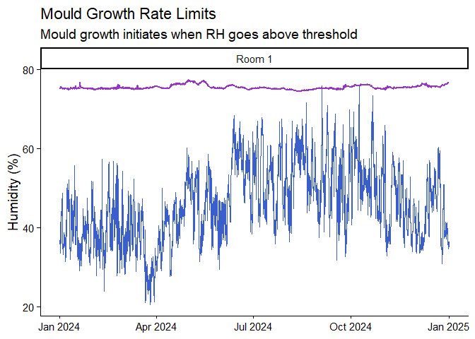

<!-- README.md is generated from README.Rmd. Please edit that file -->

# ConSciR

<!-- badges: start -->

<!-- badges: end -->

`ConSciR` is an R package that provides data science tools for
conservation science.

It includes functions for environmental applications, humidity
calculations, sustainability metrics, engineering calculations, and data
visualisations such as psychrometric charts. The toolkit is designed to
assist conservators, scientists, and engineers in performing
calculations, analysing data, and streamlining common tasks in cultural
heritage conservation.

`ConSciR` is intended for:  
- Conservators working in museums, galleries, and heritage sites  
- Conservation scientists, engineers, and researchers  
- Data scientists developing applications for conservation  
- Cultural heritage professionals involved in preventive conservation  
- Students and educators in conservation and heritage science programmes

The package is also designed to be:  
- **FAIR**: Findable, Accessible, Interoperable, and Reusable  
- **Collaborative**: enabling contributions, feature requests, bug
reports, and additions from the wider community

If using R for the first time, read an article here: [Using R for the
first
time](https://bhavshah01.github.io/ConSciR/articles/ConSciR-FirstTimeR.html)

## Tools

- Humidity calculations, conservator tools, and sustainability metrics.
- Mould growth models and damage risk functions.
- Graphical outputs including temperature-relative humidity (TRH) plots,
  psychrometric charts and data for other applications.
- Data tidying functions compatible with Meaco and Hanwell environmental
  monitoring devices.
- Interactive Shiny applications enabling dynamic data exploration and
  visualisation.

## Install and load

``` r
install.packages("ConSciR")
library(ConSciR)
```

You can install the development version of the package from GitHub using
the `pak` package:

``` r
install.packages("pak")
pak::pak("BhavShah01/ConSciR")

# Alternatively
# install.packages("devtools")
# devtools::install_github("BhavShah01/ConSciR")
```

For full details on all functions, see the package
[Reference](https://bhavshah01.github.io/ConSciR/reference/index.html)
manual.

## Examples

This section demonstrates some common tasks you can perform with the
ConSciR package.

- **Load packages**  
  Load ConSciR and some commonly used tidyverse packages for data
  manipulation and plotting.

``` r
library(ConSciR)
library(dplyr)
library(ggplot2)
```

- **Access an example dataset**  
  A pre-loaded dataset (`mydata`) is included for testing and
  demonstration. Use `head()` to view the first few rows and inspect the
  data structure.
- Users can rename columns and structure their own datasets similarly to
  `mydata` to ensure compatibility with ConSciR functions, which expect
  variables such as temperature and relative humidity in specific column
  names.

``` r
# My TRH data
filepath <- data_file_path("mydata.xlsx")
mydata <- readxl::read_excel(filepath, sheet = "mydata")
mydata <- mydata |> filter(Sensor == "Room 1")

head(mydata)
#> # A tibble: 6 × 5
#>   Site   Sensor Date                 Temp    RH
#>   <chr>  <chr>  <dttm>              <dbl> <dbl>
#> 1 London Room 1 2024-01-01 00:00:00  21.8  36.8
#> 2 London Room 1 2024-01-01 00:15:00  21.8  36.7
#> 3 London Room 1 2024-01-01 00:29:59  21.8  36.6
#> 4 London Room 1 2024-01-01 00:44:59  21.7  36.6
#> 5 London Room 1 2024-01-01 00:59:59  21.7  36.5
#> 6 London Room 1 2024-01-01 01:14:59  21.7  36.2
```

- **Perform calculations on the data**  
  Use ConSciR functions to add metrics such as dew point, absolute
  humidity, mould, preservation index and others to the dataset. More
  functions are available; see the package
  [Reference](https://bhavshah01.github.io/ConSciR/reference/index.html)
  for details.

``` r
# Peform calculations
head(mydata) |>
  mutate(
    # Dew point
    DewP = calcDP(Temp, RH), 
    
    # Absolute humidity
    Abs = calcAH(Temp, RH), 
    
    # Mould risk 
    Mould = ifelse(RH > calcMould_Zeng(Temp, RH), "Mould risk", "No mould"), 
    
    # Preservation Index, years to deterioration 
    PI = calcPI(Temp, RH), 
    
    # Scenario: Humidity if the temperature was 2°C higher
    RH_if_2C_higher = calcRH_AH(Temp + 2, Abs) 
    ) |>
  glimpse()
#> Rows: 6
#> Columns: 10
#> $ Site            <chr> "London", "London", "London", "London", "London", "Lon…
#> $ Sensor          <chr> "Room 1", "Room 1", "Room 1", "Room 1", "Room 1", "Roo…
#> $ Date            <dttm> 2024-01-01 00:00:00, 2024-01-01 00:15:00, 2024-01-01 …
#> $ Temp            <dbl> 21.8, 21.8, 21.8, 21.7, 21.7, 21.7
#> $ RH              <dbl> 36.8, 36.7, 36.6, 36.6, 36.5, 36.2
#> $ DewP            <dbl> 6.383970, 6.344456, 6.304848, 6.216205, 6.176529, 6.05…
#> $ Abs             <dbl> 7.052415, 7.033251, 7.014087, 6.973723, 6.954670, 6.89…
#> $ Mould           <chr> "No mould", "No mould", "No mould", "No mould", "No mo…
#> $ PI              <dbl> 45.25849, 45.38181, 45.50580, 46.07769, 46.20393, 46.5…
#> $ RH_if_2C_higher <dbl> 32.81971, 32.73052, 32.64134, 32.63838, 32.54920, 32.2…
```

- **Combine analysis with visualisation**  
  Add a dew point line to the temperature-relative humidity graph using
  the package’s built-in plotting function **`graph_TRH()`**.

``` r
mydata |>
  mutate(DewPoint = calcDP(Temp, RH)) |>
  graph_TRH() + 
  geom_line(aes(Date, DewPoint), col = "cyan3") + # add dew point 
  theme_bw()
```


- **Conservator tools: mould growth estimation**  
  Calculate mould growth risk using **`calcMould_Zeng()`** function and
  visualise it alongside humidity data.

``` r
mydata |>
  mutate(Mould = calcMould_Zeng(Temp, RH)) |>
  ggplot() +
  geom_line(aes(Date, RH), col = "royalblue3") +
  geom_line(aes(Date, Mould), col = "darkorchid", size = 1) +
  labs(title = "Mould Growth Rate Limits", 
       subtitle = "Mould growth initiates when RH goes above threshold",
       x = NULL, y = "Humidity (%)") +
  facet_grid(~Sensor) + 
  theme_classic(base_size = 14)
```



- **Graphs: generate a psychrometric chart**  
  Visualise the data using a psychrometric chart with the function
  `graph_psychrometric()`. The example shows how a basic plot can be
  customised; data transparency, temperature and humidity ranges, and
  the y-axis function.

``` r
# Customise 
mydata |>
  graph_psychrometric(
    data_alpha = 0.2,
    LowT = 8, 
    HighT = 28,
    LowRH = 30,
    HighRH = 70,
    y_func = calcAH
    ) +
  theme_classic() + 
  labs(title = "Psychrometric chart")
```


