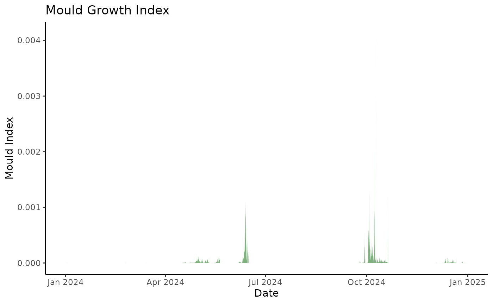

# ConSciR

## Introduction

`ConSciR` provides tools for the analysis of cultural heritage
preventive conservation data. It includes functions for environmental
data analysis, humidity calculations, sustainability metrics,
conservation risks, and data visualisations such as psychrometric
charts. It is designed to support conservators, scientists, and
engineers by streamlining common calculations and tasks encountered in
heritage conservation workflows. The package is motivated by the
framework outlined in Cosaert and Beltran et al. (2022) [“Tools for the
Analysis of Collection
Environments”](https://www.getty.edu/conservation/publications_resources/pdf_publications/tools_for_the_analysis_of_collection_environments.html "Getty Tools publication").

## Install and load

``` r
install.packages("ConSciR")
library(ConSciR)
```

You can install the development version of the package from GitHub using
the `pak` package:

``` r
install.packages("pak")
pak::pak("BhavShah01/ConSciR")

# Alternatively
# install.packages("devtools")
# devtools::install_github("BhavShah01/ConSciR")
```

Visit the package GitHub page for updates and source code: [ConSciR
Github](https://github.com/BhavShah01/ConSciR)

This vignette provides a practical introduction to the package’s
functionalities. For full details on all functions, see the package
[Reference](https://bhavshah01.github.io/ConSciR/reference/index.html)
manual or use `?function_name` within R.

## Examples

Load some useful packages:

``` r
# Load packages
library(ConSciR)
library(dplyr)
library(ggplot2)
```

### Add calculated values

Transform your dataset with the functions in ConSciR:

``` r
filepath <- data_file_path("mydata.xlsx")
mydata <- readxl::read_excel(filepath, sheet = "mydata")
mydata <- mydata |> filter(Sensor == "Room 1")


# Add calculated values using mutate
head(mydata) |> 
  mutate(
    
    # Humidity functions
    Absolute_Humidity = calcAH(Temp, RH), 
    Dew_Point = calcDP(Temp, RH), 
    Mixing_Ratio = calcMR(Temp, RH), 
    Humidity_Ratio = calcHR(Temp, RH),
    Enthalpy = calcEnthalpy(Temp, RH), 
    Saturation_Vapour_Pressure = calcPws(Temp), 
    Actual_Vapour_Pressure = calcPw(Temp, RH), 
    Air_Density = calcAD(Temp, RH),
    
    # Conservation risks
    Mould_Growth_Rate_mm_day = calcMould_Zeng(Temp, RH, label = TRUE),
    Mould_Growth_Limit = calcMould_Zeng(Temp, RH), 
    Mould_Growth_Risk = ifelse(RH > Mould_Growth_Limit, "Mould risk", "No risk"),
    Mould_Growth_Index = calcMould_VTT(Temp, RH), 
    Lifetime = calcLM(Temp, RH), 
    Preservation_Index = calcPI(Temp, RH), 
    EMC_Wood = calcEMC_wood(Temp, RH),
    
    # Sustainability calculations 
    Temp_from_DP = calcTemp(RH, Dew_Point),
    RH_from_DP = calcRH_DP(Temp, Dew_Point),
    RH_from_AH = calcRH_AH(Temp, Absolute_Humidity),
    RH_if_2C_higher = calcRH_AH(Temp + 2, Absolute_Humidity)
    
  ) |>
  glimpse()
#> Rows: 6
#> Columns: 24
#> $ Site                       <chr> "London", "London", "London", "London", "Lo…
#> $ Sensor                     <chr> "Room 1", "Room 1", "Room 1", "Room 1", "Ro…
#> $ Date                       <dttm> 2024-01-01 00:00:00, 2024-01-01 00:15:00, …
#> $ Temp                       <dbl> 21.8, 21.8, 21.8, 21.7, 21.7, 21.7
#> $ RH                         <dbl> 36.8, 36.7, 36.6, 36.6, 36.5, 36.2
#> $ Absolute_Humidity          <dbl> 7.052415, 7.033251, 7.014087, 6.973723, 6.9…
#> $ Dew_Point                  <dbl> 6.383970, 6.344456, 6.304848, 6.216205, 6.1…
#> $ Mixing_Ratio               <dbl> 5.957278, 5.940935, 5.924593, 5.888156, 5.8…
#> $ Humidity_Ratio             <dbl> 5.957278, 5.940935, 5.924593, 5.888156, 5.8…
#> $ Enthalpy                   <dbl> 37.15665, 37.11512, 37.07359, 36.87888, 36.…
#> $ Saturation_Vapour_Pressure <dbl> 26.12119, 26.12119, 26.12119, 25.96205, 25.…
#> $ Actual_Vapour_Pressure     <dbl> 9.612598, 9.586477, 9.560356, 9.502110, 9.4…
#> $ Air_Density                <dbl> 1.192445, 1.192457, 1.192469, 1.192899, 1.1…
#> $ Mould_Growth_Rate_mm_day   <dbl> 0, 0, 0, 0, 0, 0
#> $ Mould_Growth_Limit         <dbl> 75.11542, 75.11542, 75.11542, 75.14014, 75.…
#> $ Mould_Growth_Risk          <chr> "No risk", "No risk", "No risk", "No risk",…
#> $ Mould_Growth_Index         <dbl> 0, 0, 0, 0, 0, 0
#> $ Lifetime                   <dbl> 1.107855, 1.108860, 1.109869, 1.109854, 1.1…
#> $ Preservation_Index         <dbl> 45.25849, 45.38181, 45.50580, 46.07769, 46.…
#> $ EMC_Wood                   <dbl> 7.201471, 7.186361, 7.171247, 7.173308, 7.1…
#> $ Temp_from_DP               <dbl> 21.8, 21.8, 21.8, 21.7, 21.7, 21.7
#> $ RH_from_DP                 <dbl> 36.8, 36.7, 36.6, 36.6, 36.5, 36.2
#> $ RH_from_AH                 <dbl> 36.8, 36.7, 36.6, 36.6, 36.5, 36.2
#> $ RH_if_2C_higher            <dbl> 32.81971, 32.73052, 32.64134, 32.63838, 32.…


head(mydata) |> 
  tidy_TRHdata() |> # tidy
  add_time_vars() |> # add time factors 
  add_humidity_calcs() |> # add humidity values 
  add_conservation_calcs() |> # add conservation risks
  add_humidity_adjustments() # add environmental zones and RH adjustments
#> # A tibble: 6 × 64
#>   Site   Sensor date                 Temp    RH seasonyear      season monthyear
#>   <chr>  <chr>  <dttm>              <dbl> <dbl> <ord>           <ord>  <ord>    
#> 1 London Room 1 2024-01-01 00:00:00  21.8  36.8 "winter\n(DJF)… winte… January …
#> 2 London Room 1 2024-01-01 00:15:00  21.8  36.7 "winter\n(DJF)… winte… January …
#> 3 London Room 1 2024-01-01 00:29:59  21.8  36.6 "winter\n(DJF)… winte… January …
#> 4 London Room 1 2024-01-01 00:44:59  21.7  36.6 "winter\n(DJF)… winte… January …
#> 5 London Room 1 2024-01-01 00:59:59  21.7  36.5 "winter\n(DJF)… winte… January …
#> 6 London Room 1 2024-01-01 01:14:59  21.7  36.2 "winter\n(DJF)… winte… January …
#> # ℹ 56 more variables: daylight <fct>, Date <dttm>, day <dttm>, hour <int>,
#> #   dayhour <dttm>, weekday <ord>, Month <dbl>, month <ord>, year <dbl>,
#> #   DayYear <date>, Summer <chr>, Period <chr>, Pws <dbl>, Pw <dbl>, DP <dbl>,
#> #   AH <dbl>, AD <dbl>, MR <dbl>, SH <dbl>, Enthalpy <dbl>, Mould_LIM <dbl>,
#> #   Mould_risk <chr>, Mould_rate <dbl>, Mould_index <dbl>,
#> #   PreservationIndex <dbl>, Lifetime <dbl>, EMC_wood <dbl>, TRH_within <lgl>,
#> #   T_lower <lgl>, T_higher <lgl>, RH_lower <lgl>, RH_higher <lgl>, …
```

### Visualise and explore data

Combine calculations and plotting to explore patterns visually:

``` r

mydata |>
  # Calculate Absolute Humidity and Dew Point
  mutate(
    AbsHum = calcAH(Temp, RH),
    DewPoint = calcDP(Temp, RH)
  ) |>
  # Create base plot using graph_TRH function
  graph_TRH() +
  # Add Absolute Humidity line
  geom_line(aes(Date, AbsHum), color = "cyan4", alpha = 0.7) +
  # Add Dew Point line
  geom_line(aes(Date, DewPoint), color = "mediumvioletred", alpha = 0.7) +
  # Apply a theme
  theme_bw()
```


- **Conservator tools: mould growth index**  
  Calculate mould growth index using
  **[`calcMould_VTT()`](https://bhavshah01.github.io/ConSciR/reference/calcMould_VTT.md)**
  and visualise it alongside humidity data.

``` r
mydata |>
  mutate(Mould = calcMould_VTT(Temp, RH)) |>
  ggplot() +
  geom_area(aes(Date, Mould), fill = "lightseagreen") +
  labs(title = "Mould Growth Index", y = "Mould Index", x = NULL) + 
  theme_bw()
```



### Psychrometric Chart

Create psychrometric charts from temperature and humidity data. The
functions from the package can be used to change the calculations used.

``` r

head(mydata, 100) |>
  graph_psychrometric(
    LowT = 12, 
    HighT = 28,
    LowRH = 40, 
    HighRH = 70,
    data_alpha = 0.3,
    y_func = calcAH
  ) + 
  theme_classic()
```


------------------------------------------------------------------------
