# Humidity functions

``` r
library(ConSciR)
library(dplyr)
library(ggplot2)
library(readxl)
library(IAPWS95)
```

Humidity tells us how much water vapour is in the air. Conservators,
scientists and engineers use different ways, called humidity functions,
to describe these water vapour levels and how they relate to temperature
and moisture in the air.

These functions are very important for things like designing and
improving air conditioning systems and managing micro-climates. They
also play a role in understanding and preventing damage to humidity
sensitive materials and heritage objects, which can be harmed by too
much or too little moisture. The humidity functions explained here show
how temperature and relative humidity connect. Knowing these
relationships helps predict when moisture will form as dew or frost,
which can cause problems if not controlled.

It’s important to note that these functions assume normal atmospheric
pressure and have been tested for temperatures roughly between 0.5°C and
50°C and for all levels of humidity from dry to fully saturated air
(0–100% RH). Outside these ranges, the calculations might be less
reliable.

### Datasets

**mydata**

This dataset contains environmental monitoring data collected from
example heritage sites.

It includes measurements of temperature (°C) and relative humidity (%)
recorded by sensors over time.

| **Variable** | **Description**                               |
|:-------------|:----------------------------------------------|
| Site         | Location name, e.g., “Museum”, “London”       |
| Sensor       | Identifier for the specific sensor            |
| Date         | Timestamp of the measurement (POSIXct format) |
| Temp         | Air temperature in degrees Celsius            |
| RH           | Relative humidity as percentage (0-100%)      |

Example usage to load the dataset from the package:

``` r
filepath <- data_file_path("mydata.xlsx")
mydata <- readxl::read_excel(filepath, sheet = "mydata")
mydata <- mydata |> filter(Sensor == "Room 1")

head(mydata)
#> # A tibble: 6 × 5
#>   Site   Sensor Date                 Temp    RH
#>   <chr>  <chr>  <dttm>              <dbl> <dbl>
#> 1 London Room 1 2024-01-01 00:00:00  21.8  36.8
#> 2 London Room 1 2024-01-01 00:15:00  21.8  36.7
#> 3 London Room 1 2024-01-01 00:29:59  21.8  36.6
#> 4 London Room 1 2024-01-01 00:44:59  21.7  36.6
#> 5 London Room 1 2024-01-01 00:59:59  21.7  36.5
#> 6 London Room 1 2024-01-01 01:14:59  21.7  36.2

mydata |> graph_TRH() + theme_bw() + labs(title = "Room 1", subtitle = "mydata")
```

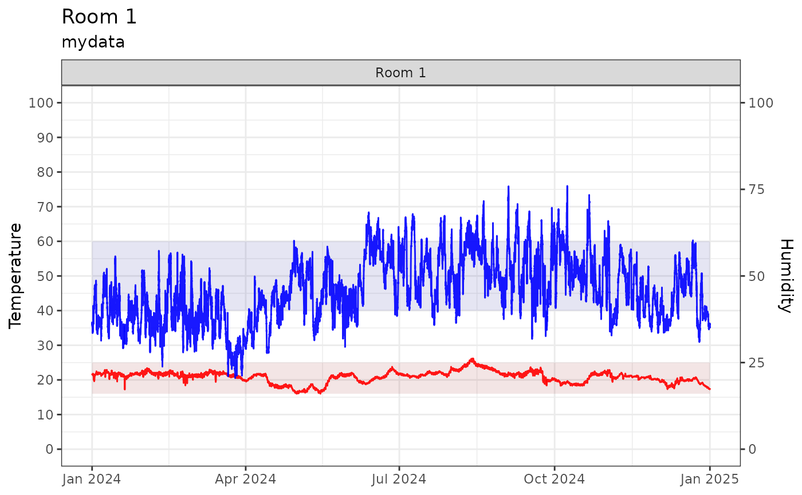

**TRHgrid: Dataset used to visualise the functions**

This dataset consists of a grid of temperature and relative humidity
values used to visualise function behavior. Temperatures range from 0°C
to 100°C in 0.25°C increments, and relative humidity (RH) ranges from 0%
to 100% in 1% increments. The complete factorial combination of
temperature and RH values is created using expand.grid(), where each
pair represents a unique condition.

Contour plots are generated to show interactions between derived
variables across the temperature-RH grid. The dataset also supports
validation checks for temperature and humidity calculations to
understand relationships among the functions.

Example R code to generate the dataset:

``` r
Temp <- seq(0, 100, 0.25)
RH <- seq(0, 100, 1)

TRHgrid <- 
  expand.grid(Temp, RH) |> 
  tibble() |> 
  rename(Temp = Var1, RH = Var2) 

summary(TRHgrid)
#>       Temp           RH     
#>  Min.   :  0   Min.   :  0  
#>  1st Qu.: 25   1st Qu.: 25  
#>  Median : 50   Median : 50  
#>  Mean   : 50   Mean   : 50  
#>  3rd Qu.: 75   3rd Qu.: 75  
#>  Max.   :100   Max.   :100
```

### Example workflows

#### Adjusting Humidity using the package functions

Starting with measurements of temperature (`Temp`) and relative humidity
(`RH`), several derived variables commonly used can be calculated:

``` r
# Functions applied on the mydata dataset
head(mydata) |> 
  mutate(
    Absolute_Humidity = calcAH(Temp, RH), 
    Dew_Point = calcDP(Temp, RH), 
    Frost_Point = calcFP(Temp, RH),
    Mixing_Ratio = calcMR(Temp, RH), 
    Specific_Humidity = calcSH(Temp, RH),
    Humidity_Ratio = calcHR(Temp, RH),
    Enthalpy = calcEnthalpy(Temp, RH), 
    Saturation_Vapour_Pressure = calcPws(Temp), 
    Actual_Vapour_Pressure = calcPw(Temp, RH), 
    RH_VP = 100 * (Actual_Vapour_Pressure / Saturation_Vapour_Pressure),
    Air_Density = calcAD(Temp, RH),
    Temp_calc = calcTemp(RH, Dew_Point),
    RH_AH_calc = calcRH_AH(Temp, Absolute_Humidity),
    RH_DP_calc = calcRH_DP(Temp, Dew_Point)
  ) |>
  glimpse()
#> Rows: 6
#> Columns: 19
#> $ Site                       <chr> "London", "London", "London", "London", "Lo…
#> $ Sensor                     <chr> "Room 1", "Room 1", "Room 1", "Room 1", "Ro…
#> $ Date                       <dttm> 2024-01-01 00:00:00, 2024-01-01 00:15:00, …
#> $ Temp                       <dbl> 21.8, 21.8, 21.8, 21.7, 21.7, 21.7
#> $ RH                         <dbl> 36.8, 36.7, 36.6, 36.6, 36.5, 36.2
#> $ Absolute_Humidity          <dbl> 7.052415, 7.033251, 7.014087, 6.973723, 6.9…
#> $ Dew_Point                  <dbl> 6.383970, 6.344456, 6.304848, 6.216205, 6.1…
#> $ Frost_Point                <dbl> 8.260808, 8.225778, 8.190662, 8.100017, 8.0…
#> $ Mixing_Ratio               <dbl> 5.957278, 5.940935, 5.924593, 5.888156, 5.8…
#> $ Specific_Humidity          <dbl> 0.8562656, 0.8559272, 0.8555872, 0.8548233,…
#> $ Humidity_Ratio             <dbl> 5.957278, 5.940935, 5.924593, 5.888156, 5.8…
#> $ Enthalpy                   <dbl> 37.15665, 37.11512, 37.07359, 36.87888, 36.…
#> $ Saturation_Vapour_Pressure <dbl> 26.12119, 26.12119, 26.12119, 25.96205, 25.…
#> $ Actual_Vapour_Pressure     <dbl> 9.612598, 9.586477, 9.560356, 9.502110, 9.4…
#> $ RH_VP                      <dbl> 36.8, 36.7, 36.6, 36.6, 36.5, 36.2
#> $ Air_Density                <dbl> 1.192445, 1.192457, 1.192469, 1.192899, 1.1…
#> $ Temp_calc                  <dbl> 21.8, 21.8, 21.8, 21.7, 21.7, 21.7
#> $ RH_AH_calc                 <dbl> 36.8, 36.7, 36.6, 36.6, 36.5, 36.2
#> $ RH_DP_calc                 <dbl> 36.8, 36.7, 36.6, 36.6, 36.5, 36.2
```

**Principles of Humidity Adjustment**

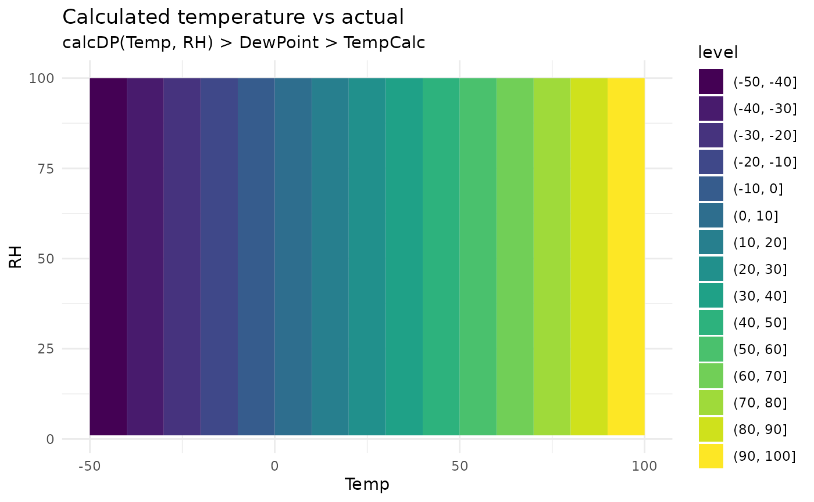

The following principles guide relative humidity adjustments under the
assumption of constant atmospheric pressure:

- **Changing Absolute Humidity:**
  - Increasing AH at constant temperature raises RH.
  - Decreasing AH at constant temperature lowers RH.
- **Changing Temperature:**
  - Lowering temperature at constant AH raises RH.
  - Raising temperature at constant AH lowers RH.
- **Using Dew Point:**
  - The smaller the difference between air temperature and dew point,
    the closer the air is to saturation (100% RH).
  - Moving temperature closer to dew point increases RH, whereas moving
    it away decreases RH.

**Changing Absolute Humidity**

The example below demonstrates adjusting RH by calculating a new
absolute humidity corresponding to a target RH (**`tRH`**) at the
measured temperature, and computing the effects on RH:

``` r

# Psychrometric chart of mydata
mydata |>
  filter(Sensor == "Room 1") |>
  graph_psychrometric(y_func = calcAH) +
  labs(title = "Room 1 Before Adjustment") + 
  theme_classic()
```

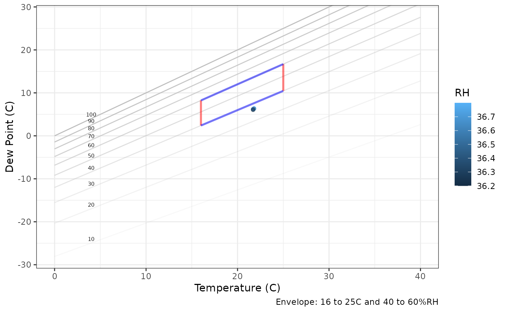

``` r

# Changing Absolute Humidity 
using_calcAH <- 
  mydata |> 
  filter(Sensor == "Room 1") |>
  mutate(
    # Calculate the Absolute humidity, AH
    AH = calcAH(Temp, RH), 
    # Calculate the Dew point, DP
    DP = calcDP(Temp, RH), 
    # Target RH, tRH 
    tRH = 50,           
    # Target Absolute Humidity, AH*
    AHstar = calcAH(Temp, tRH),     
    # Required AH change, difference between AH and AH* 
    dAH = AHstar - AH, 
    # Validation check (should be near zero)
    AHcheck = AHstar - (AH + dAH), 
    # New RH after adjustment, RH*
    RHstarAH = calcRH_AH(Temp, AHstar), 
    # RH difference from target
    RHerrorAH = RHstarAH - tRH, 
  ) 

# View adjustment summary
glimpse(using_calcAH)
#> Rows: 35,136
#> Columns: 13
#> $ Site      <chr> "London", "London", "London", "London", "London", "London", …
#> $ Sensor    <chr> "Room 1", "Room 1", "Room 1", "Room 1", "Room 1", "Room 1", …
#> $ Date      <dttm> 2024-01-01 00:00:00, 2024-01-01 00:15:00, 2024-01-01 00:29:…
#> $ Temp      <dbl> 21.8, 21.8, 21.8, 21.7, 21.7, 21.7, 21.7, 21.7, 21.7, 21.6, …
#> $ RH        <dbl> 36.8, 36.7, 36.6, 36.6, 36.5, 36.2, 36.3, 36.4, 36.0, 36.0, …
#> $ AH        <dbl> 7.052415, 7.033251, 7.014087, 6.973723, 6.954670, 6.897508, …
#> $ DP        <dbl> 6.383970, 6.344456, 6.304848, 6.216205, 6.176529, 6.056922, …
#> $ tRH       <dbl> 50, 50, 50, 50, 50, 50, 50, 50, 50, 50, 50, 50, 50, 50, 50, …
#> $ AHstar    <dbl> 9.582086, 9.582086, 9.582086, 9.526945, 9.526945, 9.526945, …
#> $ dAH       <dbl> 2.529671, 2.548835, 2.567999, 2.553221, 2.572275, 2.629437, …
#> $ AHcheck   <dbl> 0, 0, 0, 0, 0, 0, 0, 0, 0, 0, 0, 0, 0, 0, 0, 0, 0, 0, 0, 0, …
#> $ RHstarAH  <dbl> 50, 50, 50, 50, 50, 50, 50, 50, 50, 50, 50, 50, 50, 50, 50, …
#> $ RHerrorAH <dbl> 7.105427e-15, 7.105427e-15, 7.105427e-15, 0.000000e+00, 0.00…


# Plot of the difference in Absolute humidity and RH error
using_calcAH |>
  ggplot() +
  geom_line(aes(Date, dAH), col = "cyan4", alpha = 0.8) + 
  geom_line(aes(Date, RHerrorAH), col = "goldenrod", alpha = 0.8) + 
  geom_smooth(aes(Date, dAH)) + 
  labs(title = "Absolute Humidity Required to Achieve Target RH", 
       subtitle = "Positive values indicate addition of humidity",
       x = NULL, y = "Absolute Humidity (g/m^3)") +
  theme_bw()
```

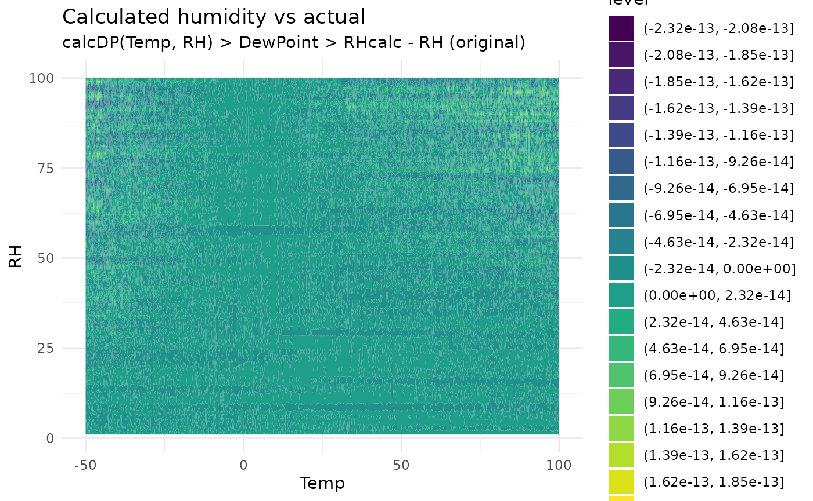

``` r


# Psychrometric chart of new data (using_calcAH) after adjustment 
using_calcAH |>
  filter(Sensor == "Room 1") |>
  graph_psychrometric(RH = "RHstarAH", y_func = calcAH) +
  labs(title = "Room 1 After Humidity Adjustment") + 
  theme_classic()
```

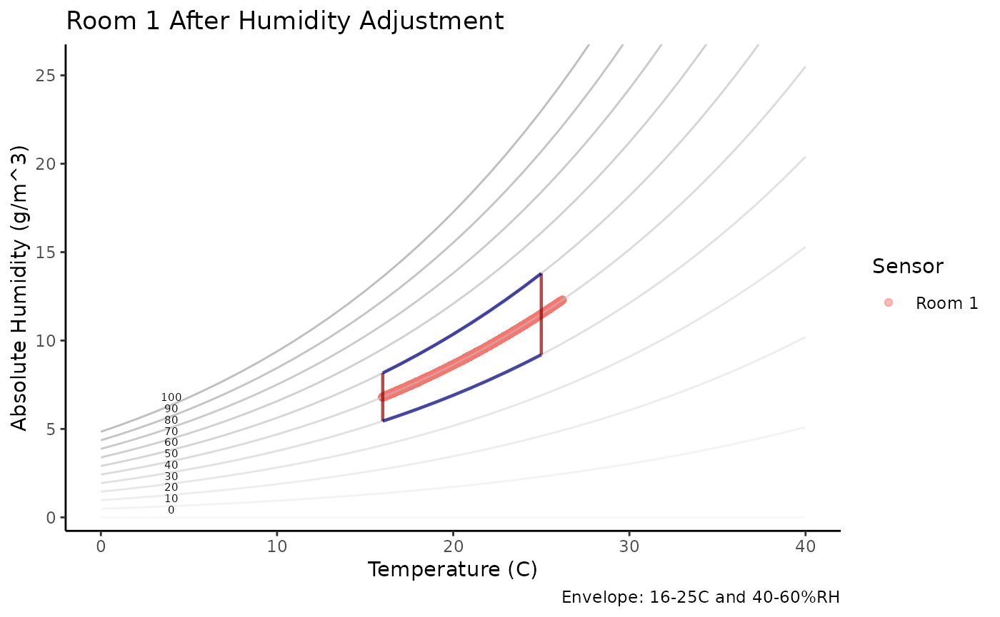

**Changing Temperature**

``` r

# Changing Temperature
using_calcTemp <- 
  mydata |> 
  mutate(
    # Absolute humidity, AH
    AH = calcAH(Temp, RH), 
    # Dew point, DP
    DP = calcDP(Temp, RH), 
    # Target RH
    tRH = 50,           
    # T*: Tstar new temperature at target RH 
    Tstar = calcTemp(tRH, DP), 
    # Difference in measure temperature and new temperature
    dTemp = Tstar - Temp, 
    # Check
    Tcheck = Tstar - (Temp + dTemp), 
    # RHstarT: New humidity with new temperature 
    RHstarT = calcRH_DP(Tstar, DP),
    # Error 
    RHerrorT = RHstarT - tRH
  )

glimpse(using_calcTemp)
#> Rows: 35,136
#> Columns: 13
#> $ Site     <chr> "London", "London", "London", "London", "London", "London", "…
#> $ Sensor   <chr> "Room 1", "Room 1", "Room 1", "Room 1", "Room 1", "Room 1", "…
#> $ Date     <dttm> 2024-01-01 00:00:00, 2024-01-01 00:15:00, 2024-01-01 00:29:5…
#> $ Temp     <dbl> 21.8, 21.8, 21.8, 21.7, 21.7, 21.7, 21.7, 21.7, 21.7, 21.6, 2…
#> $ RH       <dbl> 36.8, 36.7, 36.6, 36.6, 36.5, 36.2, 36.3, 36.4, 36.0, 36.0, 3…
#> $ AH       <dbl> 7.052415, 7.033251, 7.014087, 6.973723, 6.954670, 6.897508, 6…
#> $ DP       <dbl> 6.383970, 6.344456, 6.304848, 6.216205, 6.176529, 6.056922, 6…
#> $ tRH      <dbl> 50, 50, 50, 50, 50, 50, 50, 50, 50, 50, 50, 50, 50, 50, 50, 5…
#> $ Tstar    <dbl> 16.87424, 16.83134, 16.78833, 16.69208, 16.64899, 16.51913, 1…
#> $ dTemp    <dbl> -4.925756, -4.968663, -5.011672, -5.007924, -5.051005, -5.180…
#> $ Tcheck   <dbl> 0, 0, 0, 0, 0, 0, 0, 0, 0, 0, 0, 0, 0, 0, 0, 0, 0, 0, 0, 0, 0…
#> $ RHstarT  <dbl> 50, 50, 50, 50, 50, 50, 50, 50, 50, 50, 50, 50, 50, 50, 50, 5…
#> $ RHerrorT <dbl> -7.105427e-15, 1.421085e-14, 1.421085e-14, 1.421085e-14, 0.00…

# Plot the difference and check the error
using_calcTemp |>
  ggplot() +
  geom_line(aes(Date, dTemp), col = "firebrick", alpha = 0.8) + 
  geom_line(aes(Date, RHerrorT), col = "goldenrod", alpha = 0.8) + 
  geom_smooth(aes(Date, dTemp)) + 
  labs(title = "Temperature Required to Achieve Target RH",
       subtitle = "Positive values indicate increasing the temperature",
       x = NULL, y = "Temperature (°C)") +
  theme_bw()
```

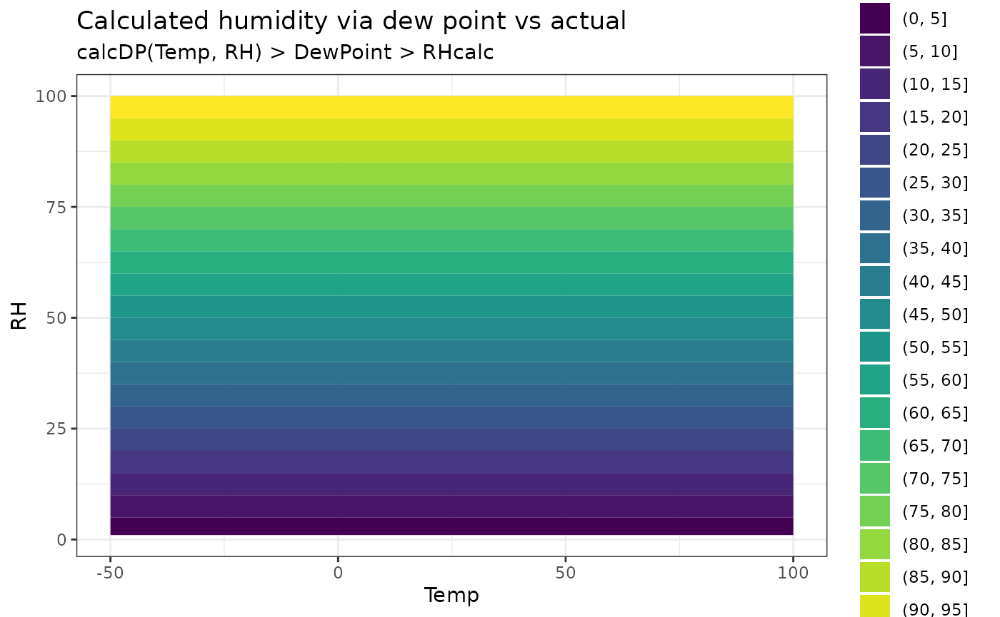

``` r

using_calcTemp |>
  graph_psychrometric(RH = "RHstarT", y_func = calcAH) +
  labs(title = "Room 1 After Temperature Adjustment",
       subtitle = "Temperature (°C)") +  
  theme_classic()
```

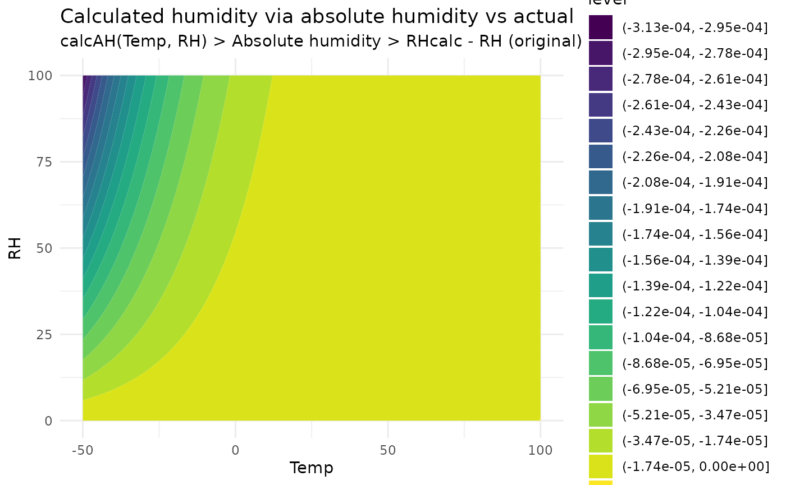

**Using Dew Point**

``` r

# Graph Dew Point
mydata |>
  graph_psychrometric(y_func = calcDP) +
  labs(title = "Room 1 Before Adjustment",
       subtitle = "Dew Point") +  
  theme_classic()
```

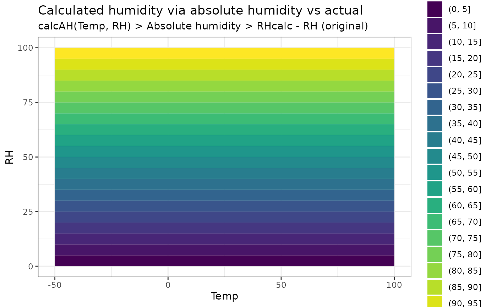

``` r

# Using Dew Point

using_calcDP <- 
  mydata |>
  mutate(
    # Absolute humidity, AH
    AH = calcAH(Temp, RH),
    # Dew point, DP
    DP = calcDP(Temp, RH),
    # Target RH
    tRH = 50,
    # DP*: DPstar new dew point at target RH 
    DPstar = calcDP(Temp, tRH),
    # RH*: New relative humidity at new dew point
    RHstarDP = calcRH_DP(Temp, DPstar),
    # Difference in measured dew point and new dew point
    dDP = DPstar - DP, 
    # Error 
    RHerrorDP = RHstarDP - tRH
  ) 

glimpse(using_calcDP)
#> Rows: 35,136
#> Columns: 12
#> $ Site      <chr> "London", "London", "London", "London", "London", "London", …
#> $ Sensor    <chr> "Room 1", "Room 1", "Room 1", "Room 1", "Room 1", "Room 1", …
#> $ Date      <dttm> 2024-01-01 00:00:00, 2024-01-01 00:15:00, 2024-01-01 00:29:…
#> $ Temp      <dbl> 21.8, 21.8, 21.8, 21.7, 21.7, 21.7, 21.7, 21.7, 21.7, 21.6, …
#> $ RH        <dbl> 36.8, 36.7, 36.6, 36.6, 36.5, 36.2, 36.3, 36.4, 36.0, 36.0, …
#> $ AH        <dbl> 7.052415, 7.033251, 7.014087, 6.973723, 6.954670, 6.897508, …
#> $ DP        <dbl> 6.383970, 6.344456, 6.304848, 6.216205, 6.176529, 6.056922, …
#> $ tRH       <dbl> 50, 50, 50, 50, 50, 50, 50, 50, 50, 50, 50, 50, 50, 50, 50, …
#> $ DPstar    <dbl> 10.91667, 10.91667, 10.91667, 10.82472, 10.82472, 10.82472, …
#> $ RHstarDP  <dbl> 50, 50, 50, 50, 50, 50, 50, 50, 50, 50, 50, 50, 50, 50, 50, …
#> $ dDP       <dbl> 4.532701, 4.572214, 4.611823, 4.608514, 4.648190, 4.767797, …
#> $ RHerrorDP <dbl> 1.421085e-14, 1.421085e-14, 1.421085e-14, 0.000000e+00, 0.00…

# Plot the difference and check the error
using_calcDP |>
  ggplot() +
  geom_line(aes(Date, dDP), col = "mediumvioletred", alpha = 0.8) + 
  geom_line(aes(Date, RHerrorDP), col = "goldenrod", alpha = 0.8) + 
  geom_smooth(aes(Date, dDP)) + 
  labs(title = "Dew Point Required to Achieve Target RH", 
       x = NULL, y = "Dew Point (°C)") +
  theme_bw()
```


``` r


using_calcDP |>
  graph_psychrometric(RH = "RHstarDP", y_func = calcDP) +
  labs(title = "Room 1 After Dew Point Adjustment",
       subtitle = "Dew Point (°C)") +  
  theme_classic()
```

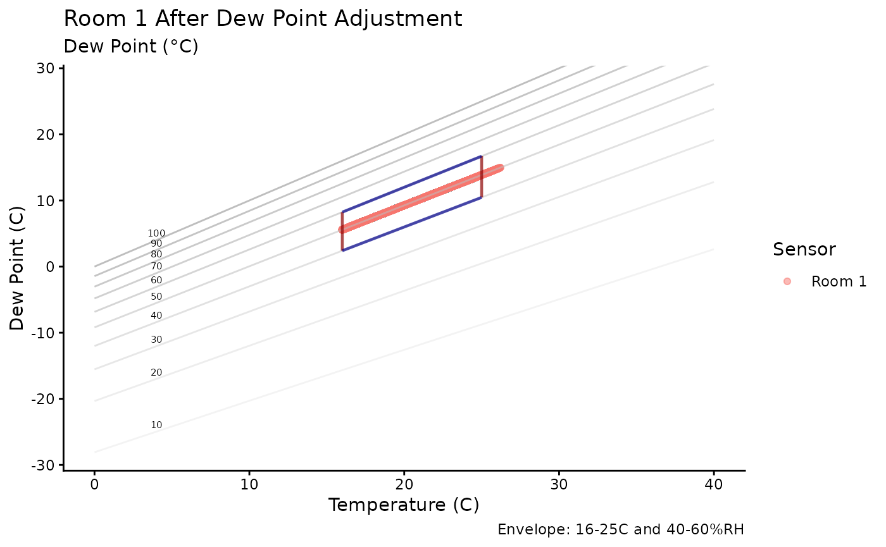

## Functions

### Water Vapour Saturation Pressure

- `calcPws`

**Water vapour saturation pressure** is the pressure at which water
vapour in the air is balanced with liquid water at a certain
temperature. It is the maximum amount of moisture air can hold at a
temperature before the moisture starts to condense into water droplets
(like dew or fog). This pressure increases as the temperature rises
because warm air can hold more moisture than cold air.

The `calcPws` function calculates the water vapour saturation pressure
(in hPa) from temperature (in °C) based on one of several empirical
formulations:

- Arden Buck equation (“Buck”) \[default\]
- International Association for the Properties of Water and Steam
  (“IAPWS”)
- August-Roche-Magnus approximation (“Magnus”)
- VAISALA humidity conversion formula (“VAISALA”)

Each formulation provides slightly different estimates of saturation
pressure, with varying complexities and accuracies suited to different
applications. A discussion of the benefits and comparative accuracy of
each equation can be found on Wikipedia:
<https://en.wikipedia.org/wiki/Vapour_pressure_of_water#cite_note-1>

``` r

# Psychrometric graph of Saturation vapour Pressure calculated via `calcPws` 
mydata |>
  graph_psychrometric(y_func = calcPws) +
  theme_bw()
```

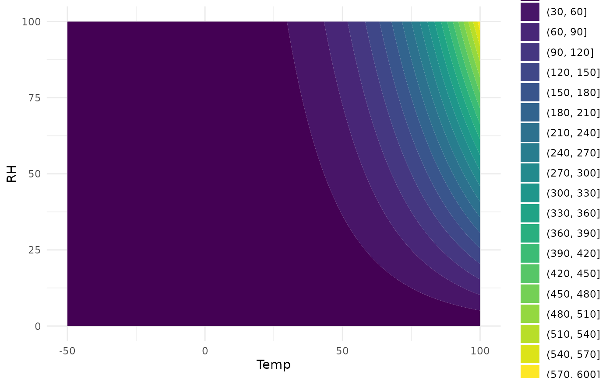

``` r

# Contour plot of saturation vapour pressure over temperature and humidity grid
TRHgrid |>
  mutate(Pws = calcPws(Temp)) |>
  ggplot(aes(Temp, RH, z = Pws)) + 
  geom_contour_filled(bins = 15) + 
  labs(title = "Saturation Vapour Pressure", x = "Temperature (°C)", y = "Humidity (%)",
       fill = "hPa") +
  theme_bw()
```

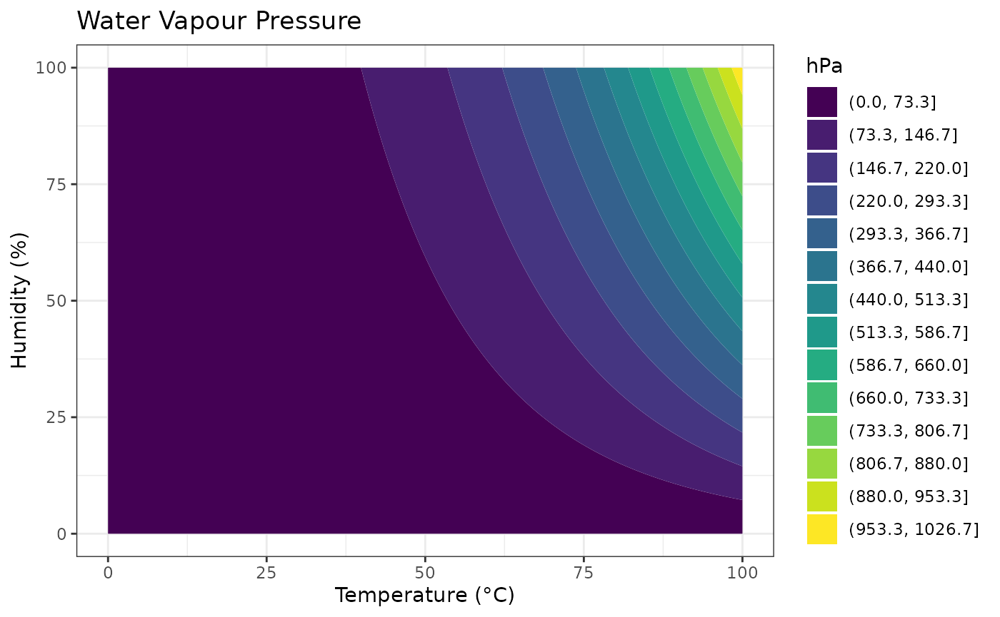

``` r

# Comparison of saturation vapour pressure calculated using different methods
mydata |>
  dplyr::mutate(
    Pw_Buck = calcPws(Temp, method = "Buck"),
    Pw_IAPWS = calcPws(Temp, method = "IAPWS"),
    Pw_Magnus = calcPws(Temp, method = "Magnus"),
    Pw_VAISALA = calcPws(Temp, method = "VAISALA")
    ) |>
  ggplot() +
  geom_line(aes(Date, Pw_Buck), col = "darkblue", alpha = 0.2) + 
  geom_line(aes(Date, Pw_IAPWS), col = "darkred", alpha = 0.2) + 
  geom_line(aes(Date, Pw_Magnus), col = "darkgreen", alpha = 0.2) + 
  geom_line(aes(Date, Pw_VAISALA), col = "orange", alpha = 0.2) + 
  labs(title = "Comparison of saturation vapour pressure equations", 
       subtitle = "Buck (blue), IAPWS (red), Magnus (green), VAISALA (orange)", 
       y = "Water vapour saturation pressure (hPa)", x = NULL) + 
  theme_bw()
```

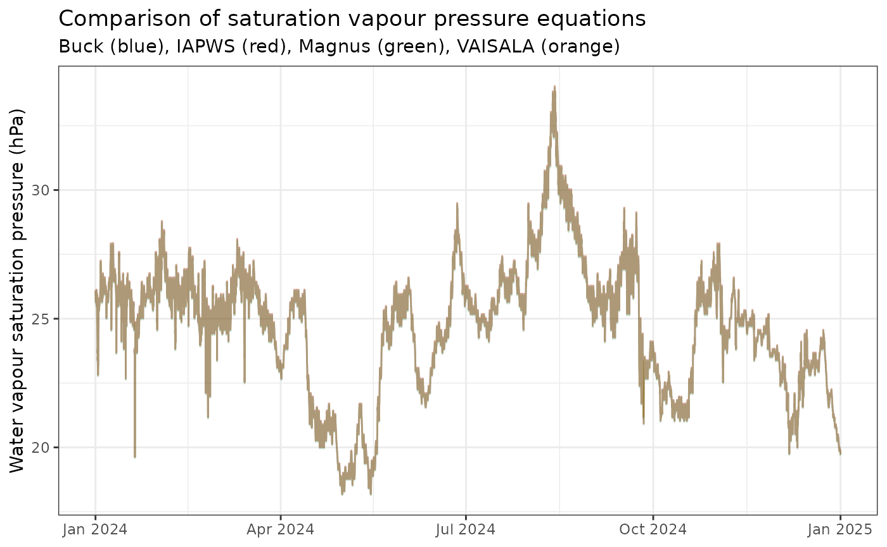

**Accuracy**

The `calcPws` function is tested against The International Association
for the Properties of Water and Steam (IAPWS) R package `IAPWS95`.

``` r
# Load IAPWS95 package for standard water/steam property functions
library(IAPWS95)

# Vectorize the pSatT function for Saturation Pressure, as a Function of Temperature
pSatT_vec <- Vectorize(pSatT) 

# Create a dataframe of temperature values from triple point of water to 100C (at saturation 100%RH)
Temp_data <- tibble(Temp = seq(0.1, 99, 0.1), RH = 100)

# Calculate saturation vapor pressure using `calcPws` and vectorised `pSatT` functions 
Temp_data <- 
  Temp_data |>
  mutate(
    TempK = Temp + 273.15,
    Pws = calcPws(Temp),
    PwsI = 10000 * pSatT_vec(TempK), 
    Pws_diff = Pws - PwsI
  )

# Create a density plot comparing the distributions of the two saturation pressure calculations
Temp_data |>
  ggplot() + 
  geom_density(aes(PwsI), col = "black") + 
  geom_density(aes(Pws), col = "red", alpha = 0.3) +
  labs(title = "Comparison of Saturation Vapor Pressure Calculations",
       subtitle = "`calcPws` Function (red) vs. IAPWS95 Standard (black)", 
       x = "Saturation Vapor Pressure (hPa)", y = "Density") + 
  theme_classic()
```

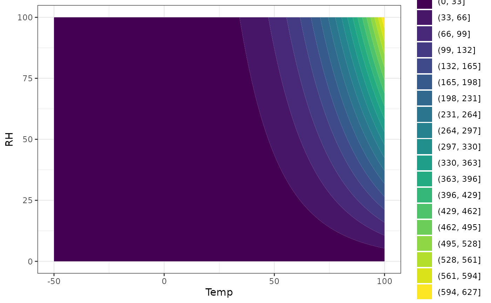

### Water Vapour Pressure

- `calcPw`

**Water vapour pressure** is the pressure exerted by water molecules
when they are in the air as a gas. It reflects how much moisture is
actually present in the air at a given temperature.

Unlike saturation vapour pressure—which is the maximum water vapour
pressure the air can hold at that temperature—water vapour pressure
tells us the current moisture level in the air.

The function `calcPw` calculates this water vapour pressure from
temperature and relative humidity.

``` r

# Psychrometric graph of Water Vapour Pressure calculated via `calcPw`, Buck method
mydata |>
  graph_psychrometric(y_func = calcPw) +
  theme_bw()
```

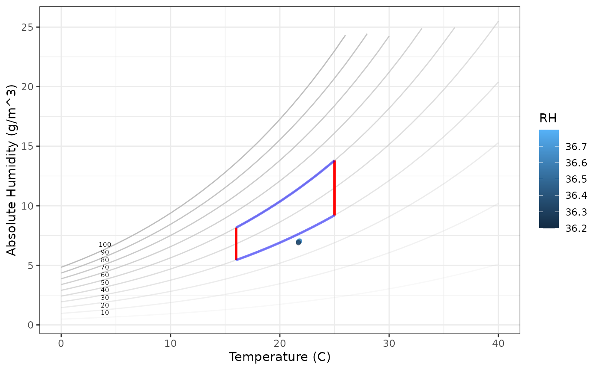

``` r

# # Contour plot of water vapour pressure over temperature and humidity grid
TRHgrid |>
  mutate(Pw = calcPw(Temp, RH)) |>
  ggplot(aes(Temp, RH, z = Pw)) + 
  geom_contour_filled(bins = 15) + 
  labs(title = "Water Vapour Pressure", 
       x = "Temperature (°C)", y = "Humidity (%)") + 
  labs(title = "Water Vapour Pressure", x = "Temperature (°C)", y = "Humidity (%)",
       fill = "hPa") +
  theme_bw()
```


### Temperature

- `calcTemp`

The temperature calculation function, `calcTemp`, uses measurements of
dew point and relative humidity to estimate the air temperature. This is
useful to check how accurately temperature can be derived from
humidity-related data. Dew point is calculated using `calcDP`.

The dew point is the temperature at which air becomes saturated and
water vapour starts to condense. Using dew point and relative humidity
together provides a way to calculate temperature indirectly.

``` r

# Calculate Dew Point and Temperature from dataset
head(mydata) |> 
  dplyr::mutate(
    DewPoint = calcDP(Temp, RH), 
    Temp_via_DP = calcTemp(RH, DewPoint),
    Temp_error = Temp_via_DP - Temp
    )
#> # A tibble: 6 × 8
#>   Site   Sensor Date                 Temp    RH DewPoint Temp_via_DP Temp_error
#>   <chr>  <chr>  <dttm>              <dbl> <dbl>    <dbl>       <dbl>      <dbl>
#> 1 London Room 1 2024-01-01 00:00:00  21.8  36.8     6.38        21.8  -3.55e-15
#> 2 London Room 1 2024-01-01 00:15:00  21.8  36.7     6.34        21.8   0       
#> 3 London Room 1 2024-01-01 00:29:59  21.8  36.6     6.30        21.8   0       
#> 4 London Room 1 2024-01-01 00:44:59  21.7  36.6     6.22        21.7  -3.55e-15
#> 5 London Room 1 2024-01-01 00:59:59  21.7  36.5     6.18        21.7   0       
#> 6 London Room 1 2024-01-01 01:14:59  21.7  36.2     6.06        21.7   0    
```

The difference (`Temp_error`) between calculated and actual temperature
reveals the accuracy of the calculation across varying temperature and
relative humidity in the TRHgrid dataset. Smaller values mean less
error.

``` r

# Error plot to visualise difference between calculated and original temperature
TRHgrid |>
  mutate(
    DewPoint = calcDP(Temp, RH),
    Temp_via_DP = calcTemp(RH, DewPoint), 
    Temp_error = Temp_via_DP - Temp
  ) |>
  ggplot(aes(Temp, RH, z = Temp_error)) + 
  geom_contour_filled() + 
  labs(title = "Difference between calculated and actual temperature", 
       subtitle = "Shows accuracy of calculation",
       x = "Temperature (°C)", y = "Humidity (%)", fill = "Difference") + 
  theme_bw()
```


### Relative Humidity

- `calcRH_AH` and `calcRH_DP`

**Relative humidity (RH)** is a measure of how much moisture is in the
air compared to the maximum amount the air can hold at that temperature.
It is expressed as a percentage: 100% means the air is fully saturated
and can hold no more moisture.

The package includes two ways to calculate relative humidity:

- **Using Dew Point** (`calcRH_DP`): This method uses the temperature
  and the dew point (the temperature at which air becomes saturated) to
  calculate relative humidity. It’s a common approach because dew point
  is often directly measured or estimated.
- **Using Absolute Humidity** (`calcRH_AH`): This method uses the
  temperature and absolute humidity (the actual amount of moisture in
  the air) to calculate relative humidity.

Contour plots compare the relative humidity calculated from these
functions against the original measured RH values, showing how closely
they match, and where errors or differences occur.

``` r

# Calculate RH from Dew Point
head(mydata) |> 
  dplyr::mutate(
    DewPoint = calcDP(Temp, RH),
    RH_via_DP = calcRH_DP(Temp, DewPoint), 
    RH_DP_error = RH_via_DP - RH
    )
#> # A tibble: 6 × 8
#>   Site   Sensor Date                 Temp    RH DewPoint RH_via_DP RH_DP_error
#>   <chr>  <chr>  <dttm>              <dbl> <dbl>    <dbl>     <dbl>       <dbl>
#> 1 London Room 1 2024-01-01 00:00:00  21.8  36.8     6.38      36.8    0       
#> 2 London Room 1 2024-01-01 00:15:00  21.8  36.7     6.34      36.7    7.11e-15
#> 3 London Room 1 2024-01-01 00:29:59  21.8  36.6     6.30      36.6    0       
#> 4 London Room 1 2024-01-01 00:44:59  21.7  36.6     6.22      36.6    0       
#> 5 London Room 1 2024-01-01 00:59:59  21.7  36.5     6.18      36.5    0       
#> 6 London Room 1 2024-01-01 01:14:59  21.7  36.2     6.06      36.2    0    

# Error plot for RH from Dew Point
TRHgrid |>
  mutate(
    DewPoint = calcDP(Temp, RH),
    RH_DPcalc = calcRH_DP(Temp, DewPoint), 
    RH_DP_error = RH_DPcalc - RH
  ) |>
  ggplot(aes(Temp, RH, z = RH_DP_error)) + 
  labs(title = "Difference between calculated and actual humidity", 
       subtitle = "RH calc from dew point minus original RH",
       x = "Temperature (°C)", y = "Humidity (%)", fill = "Difference") +
  geom_contour_filled() + 
  theme_bw()
```


``` r

# Calculate RH from Absolute Humidity
head(mydata) |> 
  dplyr::mutate(
    AH = calcAH(Temp, RH),
    RH_via_AH = calcRH_AH(Temp, AH), 
    RH_AH_error = RH_via_AH - RH
    )
#> # A tibble: 6 × 8
#>   Site   Sensor Date                 Temp    RH    AH RH_via_AH RH_AH_error
#>   <chr>  <chr>  <dttm>              <dbl> <dbl> <dbl>     <dbl>       <dbl>
#> 1 London Room 1 2024-01-01 00:00:00  21.8  36.8  7.05      36.8    7.11e-15
#> 2 London Room 1 2024-01-01 00:15:00  21.8  36.7  7.03      36.7    7.11e-15
#> 3 London Room 1 2024-01-01 00:29:59  21.8  36.6  7.01      36.6    7.11e-15
#> 4 London Room 1 2024-01-01 00:44:59  21.7  36.6  6.97      36.6    7.11e-15
#> 5 London Room 1 2024-01-01 00:59:59  21.7  36.5  6.95      36.5    7.11e-15
#> 6 London Room 1 2024-01-01 01:14:59  21.7  36.2  6.90      36.2    0    

# Error plot for RH from Absolute Humidity
TRHgrid |>
  mutate(RH_AH_error = calcRH_AH(Temp, calcAH(Temp, RH)) - RH) |>
  ggplot(aes(Temp, RH, z = RH_AH_error)) + 
  labs(title = "Difference between calculated and actual humidity", 
       subtitle = "RH calc from absolute humidity minus original RH",
       x = "Temperature (°C)", y = "Humidity (%)", fill = "Difference") +
  geom_contour_filled() + 
  theme_bw()
```

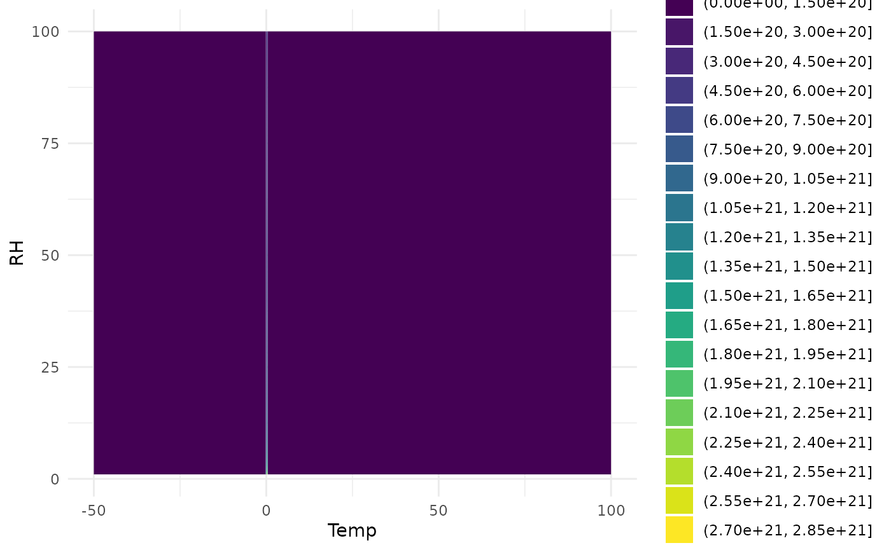

### Absolute Humidity

- `calcAH`

**Absolute humidity (AH)** measures the actual amount of water vapour
present in the air, regardless of temperature. It is expressed as the
mass of water vapour per volume of air (e.g., grams per cubic meter). In
contrast to relative humidity, absolute humidity represents the true
moisture content and does not change directly when temperature changes.

The function `calcAH` calculates absolute humidity from temperature and
relative humidity measurements.

``` r
# Graph Absolute Humidity 
mydata |>
  graph_psychrometric(y_func = calcAH) +
  theme_bw()
```

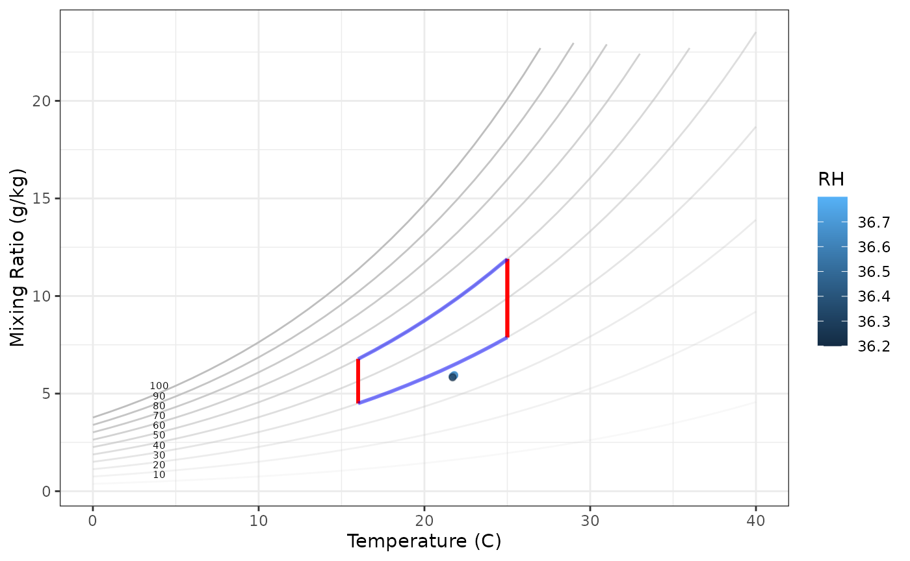

``` r

# Contour plot over temperature-relative humidity grid
TRHgrid |>
  mutate(AH = calcAH(Temp, RH)) |>
  ggplot(aes(Temp, RH, z = AH)) + 
  geom_contour_filled(bins = 15) + 
  labs(title = "Absolute Humidity", x = "Temperature (°C)", y = "Humidity (%)",
       fill = "g/m^3") +
  theme_bw()
```

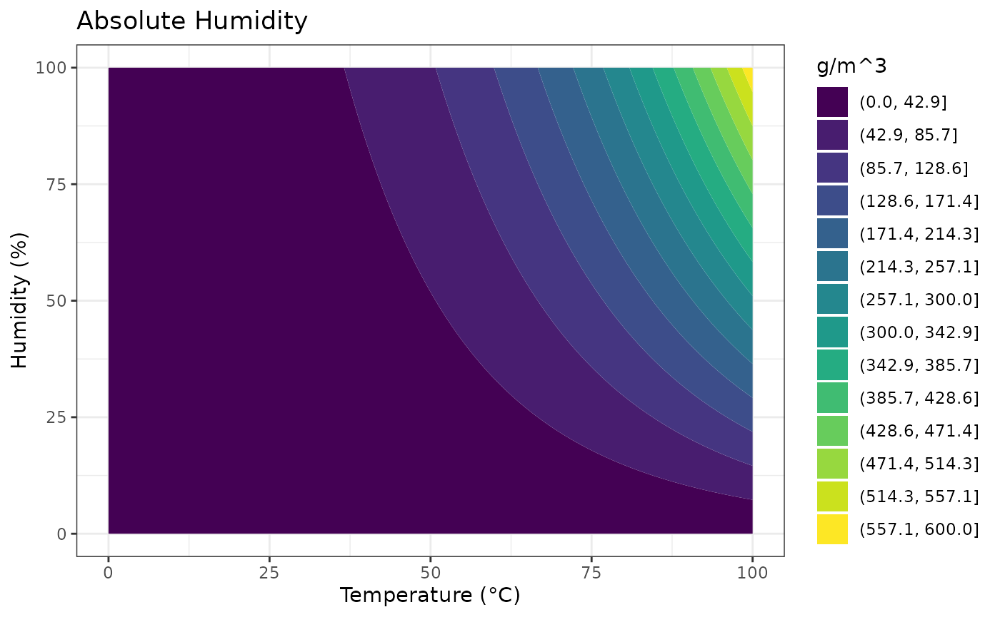

### Dew Point

- `calcDP`

**Dew point (DP)** is the temperature at which air becomes fully
saturated with moisture and water vapour begins to condense into liquid
water—forming dew, fog, or frost. It basically tells us how much
moisture is in the air.

- If the air cools down to the dew point temperature, moisture will
  start to appear as water droplets.
- The closer the dew point is to the actual air temperature, the higher
  the relative humidity and the muggier or damper the air feels.
- Dew point stays the same even if the air temperature changes, making
  it a reliable indicator of moisture content.

The function `calcDP` calculates the dew point temperature from measured
air temperature and relative humidity. It offers two calculation
methods:

- Magnus (default): August-Roche-Magnus approximation, suitable for
  temperatures 0°C to 60°C and humidity 1% to 100%.
- Buck: Arden Buck equation with Bögel modification, often providing
  greater accuracy, especially at low temperatures (down to -30°C).

``` r
# Psychrometric graph of dew point
mydata |>   
  graph_psychrometric(y_func = calcDP) +   
  theme_bw()  
```

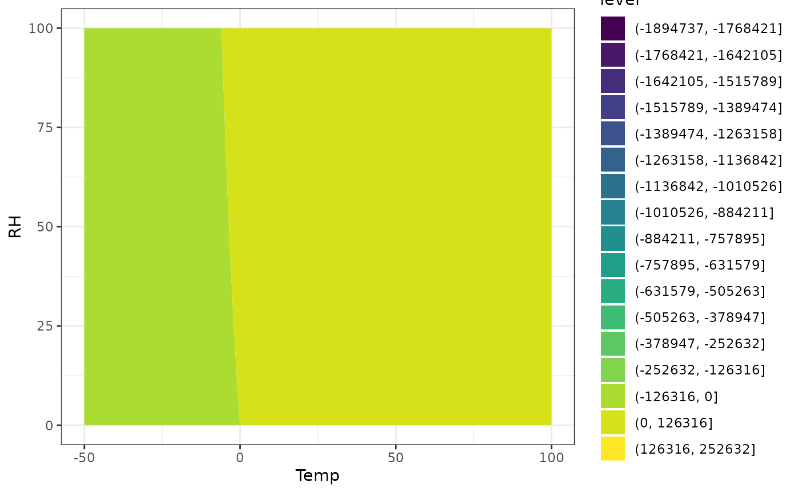

``` r

# Contour plot of dew point over temperature and RH
TRHgrid |>   
  mutate(DP = calcDP(Temp, RH)) |>   
  ggplot(aes(Temp, RH, z = DP)) +    
  geom_contour_filled(bins = 15) +    
  labs(title = "Dew Point", x = "Temperature (°C)", y = "Humidity (%)",        
       fill = "°C") +   
  theme_bw()
```

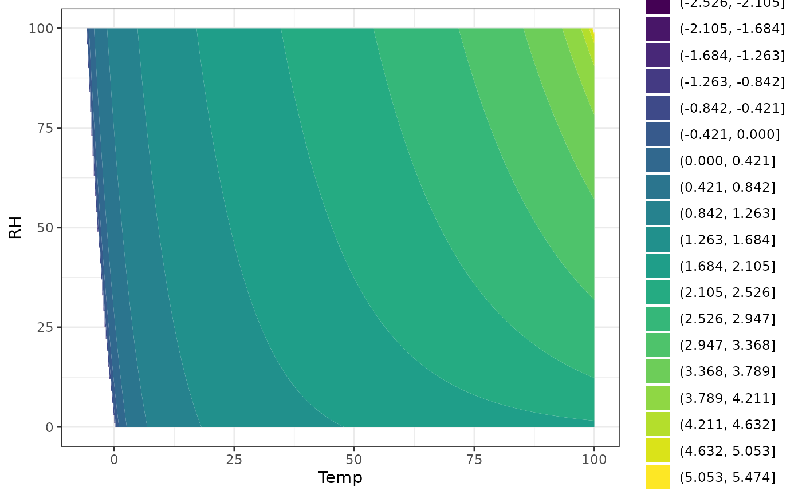

### Frost Point

- `calcFP`

**Frost Point (FP)** is the temperature at which water vapour in air
condenses as ice rather than liquid water. It is relevant when air
temperature and dew point fall below freezing, indicating conditions for
frost formation. Frost point helps in understanding moisture behavior in
cold environments, which is crucial for conservation, meteorology, and
climate control.

The calcFP function computes frost point temperature from measured air
temperature and relative humidity, extending dew point calculations
below 0°C by considering vapour pressure over ice.

Note: The frost point function (`calcFP`) is currently under development
and shows less stability in results, warranting caution in its use.

``` r

# Calculate Frost Point and add to mydata
mydata |>
  mutate(FP = calcFP(Temp, RH)) |>
  graph_TRH() +
  geom_line(aes(Date, FP), col = "cornflowerblue") + 
  labs(title = "Frost Point (light blue)") +
  theme_bw()
```

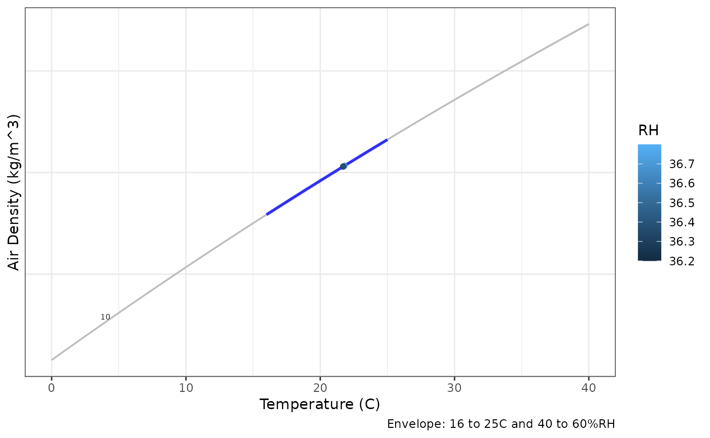

``` r

# Contour plot of frost point temperature over temperature and relative humidity grid
TRHgrid |>
  mutate(FrostPoint = calcFP(Temp, RH)) |>
  ggplot(aes(Temp, RH, z = FrostPoint)) + 
  geom_contour_filled(bins = 15) + 
  labs(title = "Frost Point", x = "Temperature (°C)", y = "Humidity (%)",
       fill = "°C") +
  theme_bw()
```

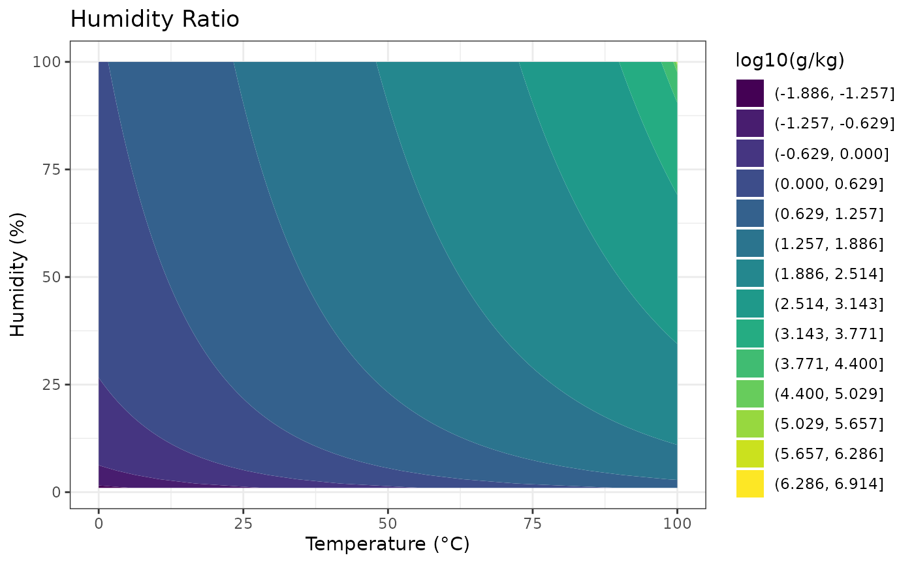

### Specific Humidity

- `calcSH`

**Specific humidity (SH)** measures the amount of water vapour in the
air relative to the total mass of the air, including both dry air and
the water vapour. It is usually expressed in grams of water vapour per
kilogram of moist air (g/kg).

Unlike relative humidity, which depends on temperature, specific
humidity directly quantifies the actual moisture content in the air and
does not change with temperature or pressure.

- Specific humidity differs slightly from the mixing ratio, which
  measures the mass of water vapour relative only to the mass of dry
  air. The key difference is that specific humidity divides by the total
  air mass (dry air plus water vapour), while the mixing ratio divides
  only by the dry air mass. Because the mass of water vapour is usually
  much smaller than the mass of dry air, the two values are very
  similar, but specific humidity is always slightly less than the mixing
  ratio.

The function `calcSH` calculates specific humidity from temperature and
relative humidity data, which helps in understanding the true moisture
amount in air regardless of changes in temperature.

``` r

# Psychrometric graph of specific humidity
mydata |>
  graph_psychrometric(y_func = calcSH) +
  theme_bw()
```

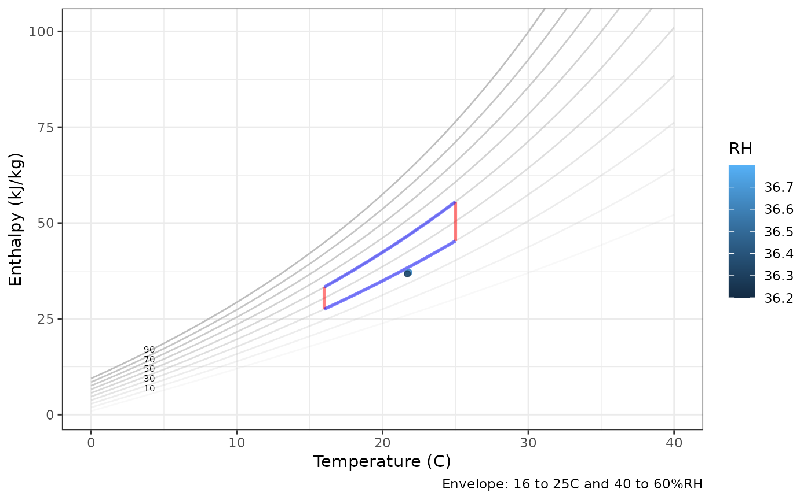

``` r

# Contour plot of specific humidity over temperature and RH
TRHgrid |>
  mutate(SH = calcSH(Temp, RH)) |>
  ggplot(aes(Temp, RH, z = SH)) + 
  geom_contour_filled(bins = 15) + 
  labs(title = "Specific Humidity", x = "Temperature (°C)", y = "Humidity (%)",
       fill = "g/kg") +
  theme_bw()
```


### Mixing Ratio

- `calcMR`

**Mixing ratio (MR)** is the mass of water vapour per unit mass of dry
air in a given volume. It is commonly expressed in grams of water vapour
per kilogram of dry air (g/kg). This measure is important because it
remains nearly constant when the air changes temperature or pressure,
making it useful for tracking moisture content in moving air masses.

- The mixing ratio tells us how much water vapour is mixed into dry air.
- It differs slightly from specific humidity (which is water vapour per
  total moist air) but is closely related.
- While both mixing ratio and specific humidity measure how much water
  vapour is in the air, the key difference lies in their denominators:
  mixing ratio expresses the mass of water vapour relative only to the
  mass of dry air, whereas specific humidity expresses it relative to
  the total mass of the moist air (dry air plus water vapour). Because
  the mass of water vapour is usually small compared to dry air, both
  values are very similar, but specific humidity is always slightly less
  than the mixing ratio.
- The mixing ratio is a fundamental concept used in meteorology, air
  conditioning, and conservation for understanding and controlling
  humidity.

The function `calcMR` calculates the mixing ratio from temperature and
relative humidity data.

``` r

# Psychrometric graph of mixing ratio
mydata |>
  graph_psychrometric(y_func = calcMR) +
  theme_bw()
```

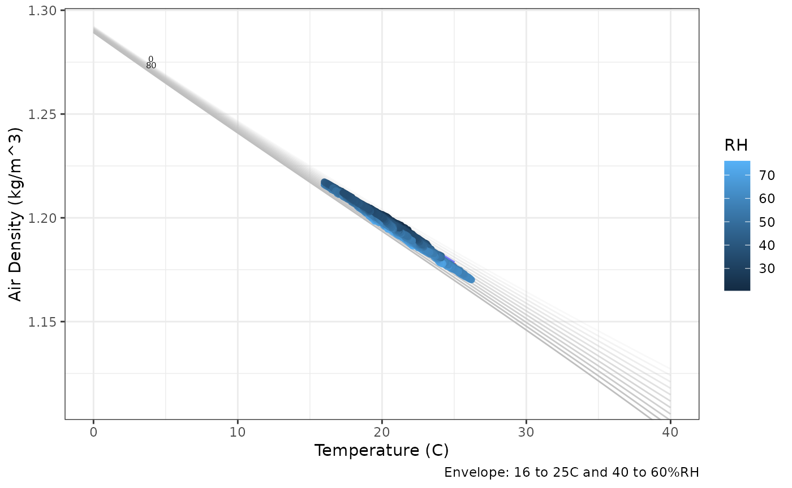

``` r

# Contour plot of mixing ratio over temperature and RH
TRHgrid |>
  mutate(MR_log10 = calcMR(Temp, RH) |> log10()) |>
  ggplot(aes(Temp, RH, z = MR_log10)) + 
  geom_contour_filled(bins = 15) + 
  labs(title = "Mixing Ratio (log)", x = "Temperature (°C)", y = "Humidity (%)",
       fill = "log10(g/kg)") +
  theme_bw()
```


### Humidity Ratio

- `calcHR`

**Humidity ratio (HR)** (also known as the mixing ratio) is the mass of
water vapour present per unit mass of dry air, typically expressed in
grams of water vapour per kilogram of dry air (g/kg). It quantifies the
actual moisture content in the air relative to the dry air component
only.

- Humidity ratio is an essential measure in meteorology, HVAC, and
  conservation, as it stays almost constant with changes in temperature
  or pressure, except when air is cooled below its dew point.
- It is used as a standard axis in psychrometric charts to represent
  moisture content.
- Unlike absolute humidity (which is mass of water vapour per volume of
  air), humidity ratio expresses water vapour relative to dry air mass,
  making it more stable for air mass comparisons.

The function `calcHR` calculates humidity ratio from temperature and
relative humidity data.

``` r

# Psychrometric graph of humidity ratio
mydata |>
  graph_psychrometric(y_func = calcHR) +
  theme_bw()
```

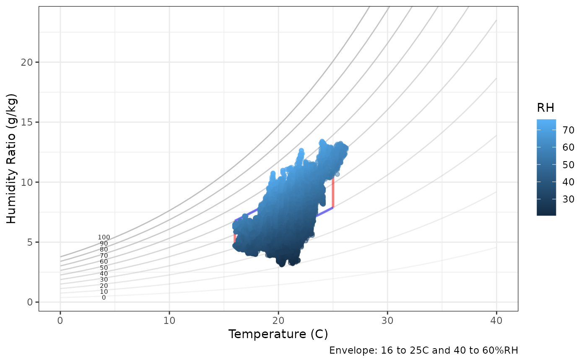

``` r

# Contour plot of humidity ratio over temperature and RH
TRHgrid |>
  mutate(HumidityRatio = calcHR(Temp, RH) |> log10()) |>
  ggplot(aes(Temp, RH, z = HumidityRatio)) + 
  geom_contour_filled(bins = 15) + 
  labs(title = "Humidity Ratio", x = "Temperature (°C)", y = "Humidity (%)",
       fill = "log10(g/kg)") +
  theme_bw()
```


### Air Density

- `calcAD`

**Air density (AD)** is the mass of air per unit volume, typically
expressed in kilograms per cubic meter (kg/m³). It depends on
temperature, atmospheric pressure, and humidity.

- Warm air is less dense than cold air because increasing temperature
  causes air to expand and occupy a larger volume.
- Humid air is less dense than dry air because water vapour has a lower
  molecular weight than the major components of dry air.
- Air density influences many physical processes, including heat
  exchange, airflow, and buoyancy.

The function **`calcAD`** calculates air density based on temperature
and relative humidity values.

``` r

# Psychrometric graph of air density
mydata |>
  graph_psychrometric(y_func = calcAD) +
  theme_bw()
```

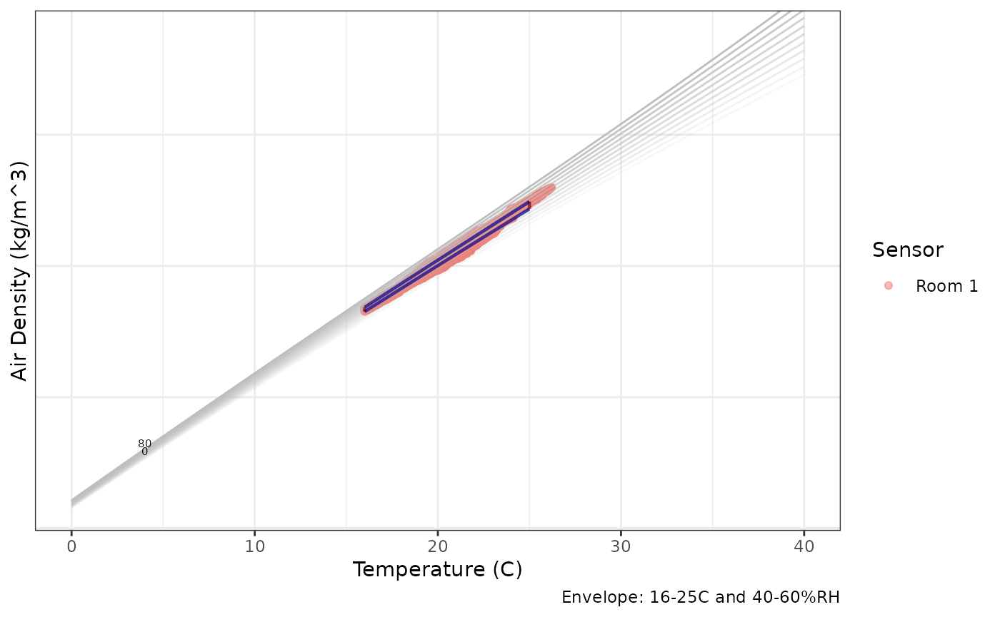

``` r

# Contour plot of air density over temperature and RH
TRHgrid |>
  mutate(AirDensity = calcAD(Temp, RH)) |>
  ggplot(aes(Temp, RH, z = AirDensity)) + 
  geom_contour_filled(bins = 15) + 
  labs(title = "Air Density", x = "Temperature (°C)", y = "Humidity (%)",
       fill = "kg/m³") +
  theme_bw()
```

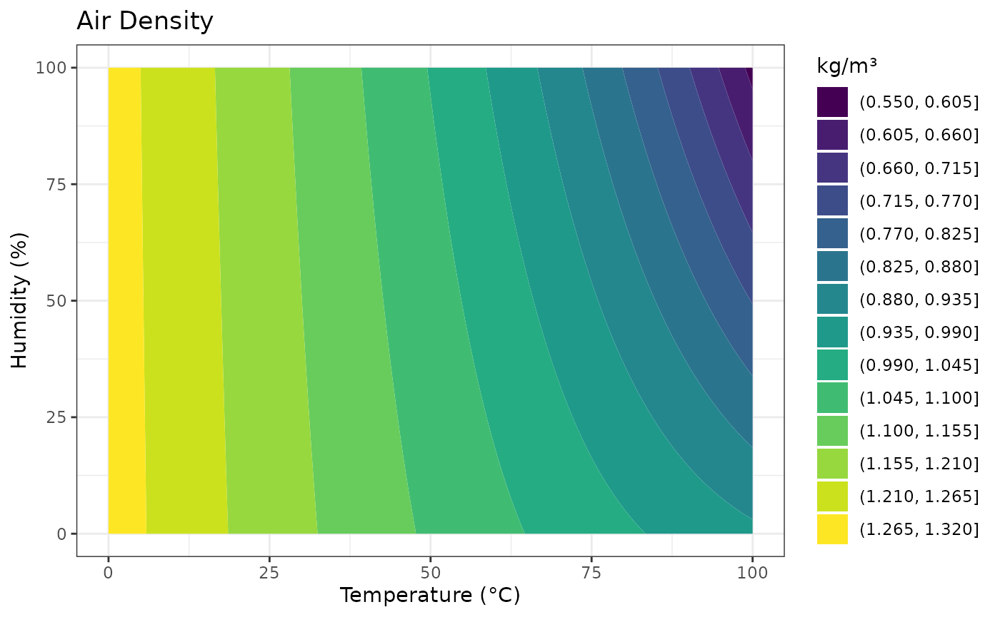

### Enthalpy

- `calcEnthalpy`

**Enthalpy** is the total heat energy content in moist air, combining
both the sensible heat from air temperature and the latent heat carried
by water vapour. It is usually measured in kilojoules per kilogram
(kJ/kg) of dry air.

- Enthalpy increases with both higher air temperature and higher
  moisture content.
- It is a key quantity for understanding heating, cooling, and
  humidification processes, as it reflects the energy required to change
  air temperature or moisture.

The function **`calcEnthalpy`** computes enthalpy using temperature and
relative humidity.

``` r

# Psychrometric graph of enthalpy
mydata |>
  graph_psychrometric(y_func = calcEnthalpy) +
  theme_bw()
```

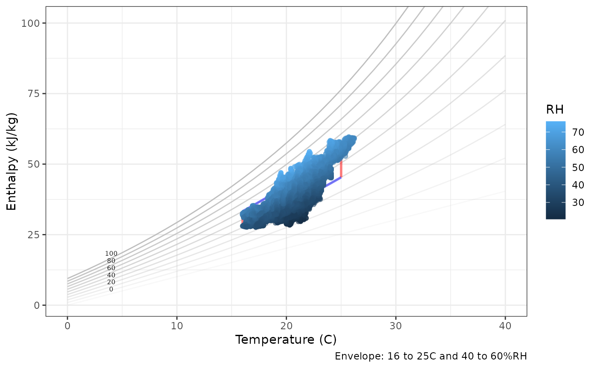

``` r

# Contour plot of enthalpy over temperature and RH
TRHgrid |>
  mutate(Enthalpy_log10 = calcEnthalpy(Temp, RH) |> log10()) |>
  ggplot(aes(Temp, RH, z = Enthalpy_log10)) + 
  geom_contour_filled(bins = 15) + 
  labs(title = "Enthalpy (log)", x = "Temperature (°C)", y = "Humidity (%)",
       fill = "log(kJ/kg)") + 
  theme_bw()
```

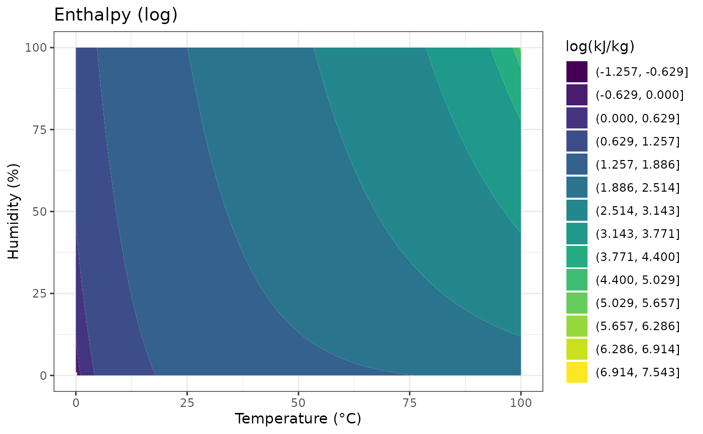

### Accuracy checks

Accuracy of the functions in ConSciR are performed by comparison against
the VAISALA online humidity calculator
(<https://humiditycalculator.vaisala.com/>),

Density plots of each variable show the distributions of the ConSciR
computed values alongside the VAISALA reference values. These plots
highlight areas of agreement as well as any systematic deviations.

The frost point function (`calcFP`) is currently under development and
shows less stability in results, warranting caution in its use.

``` r
vaisala_filepath <- data_file_path("mydata.xlsx")
vaisala_data <- readxl::read_excel(vaisala_filepath, sheet = "VAISALA", skip = 1)

vaisala <- 
  vaisala_data |>
  mutate(
    calcPws = calcPws(Temp, RH),
    calcPw = calcPw(Temp, RH),                
    calcAH = calcAH(Temp, RH), 
    calcDP = calcDP(Temp, RH), 
    calcFP = calcFP(Temp, RH), 
    calcMR = calcMR(Temp, RH), 
    calcAD = calcAD(Temp, RH),
    calcEnthalpy = calcEnthalpy(Temp, RH)
  )

vaisala |>
  ggplot() +
  geom_density(aes(Pws), color = "darkblue") +
  geom_density(aes(calcPws), alpha = 0.5, color = "skyblue") +
  labs(title = "calcPws", x = "Saturation vapor pressure (hPa)", y = "Density",
       subtitle = "Difference between ConSciR calculated values and Vaisala Humidity Calculator") +
  theme_bw()
```

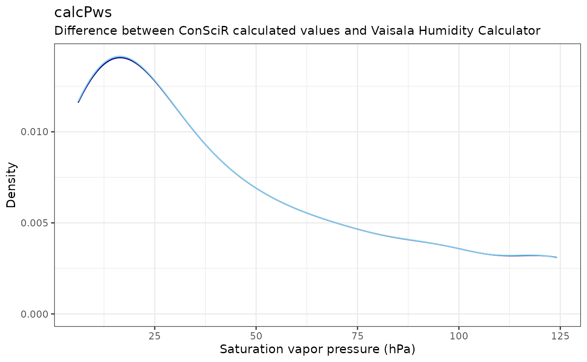

``` r

vaisala |>
  ggplot() +
  geom_density(aes(Pw), color = "darkblue") +
  geom_density(aes(calcPw), alpha = 0.5, color = "skyblue") +
  labs(title = "calcPw", x = "Water Vapour Pressure (hPa)", y = "Density",
       subtitle = "Difference between ConSciR calculated values and Vaisala Humidity Calculator") +
  theme_bw()
```

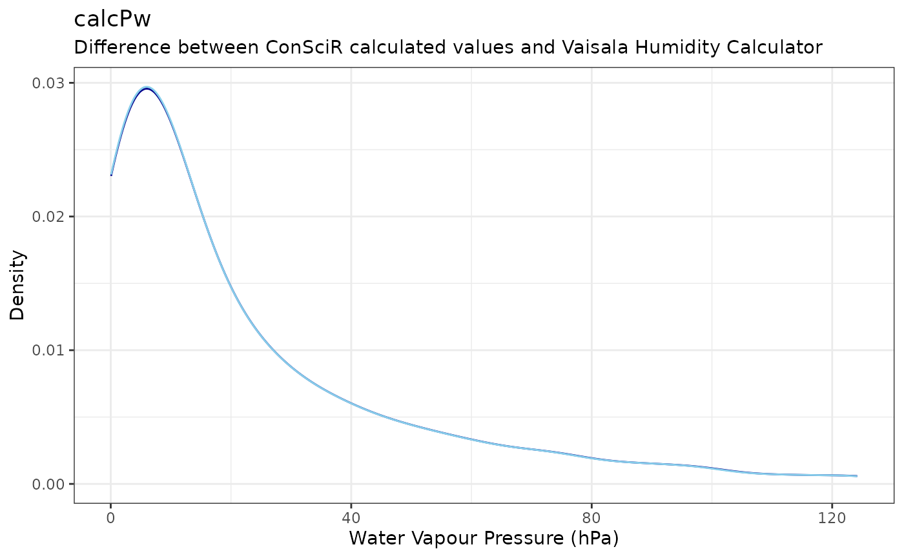

``` r

vaisala |>
  ggplot() +
  geom_density(aes(AH), color = "darkblue") +
  geom_density(aes(calcAH), alpha = 0.5, color = "skyblue") +
  labs(title = "calcAH", x = "Absolute Humidity (g/m^3)", y = "Density",
       subtitle = "Difference between ConSciR calculated values and Vaisala Humidity Calculator") +
  theme_bw()
```

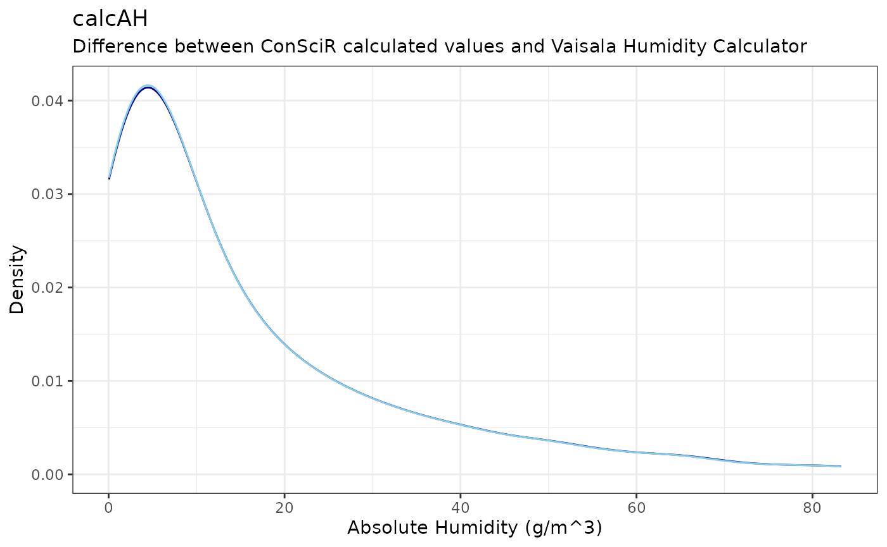

``` r

vaisala |>
  ggplot() +
  geom_density(aes(DP), color = "darkblue") +
  geom_density(aes(calcDP), alpha = 0.5, color = "skyblue") +
  labs(title = "calcDP", x = "Dew Point (°C)", y = "Density",
       subtitle = "Difference between ConSciR calculated values and Vaisala Humidity Calculator") +
  theme_bw()
```

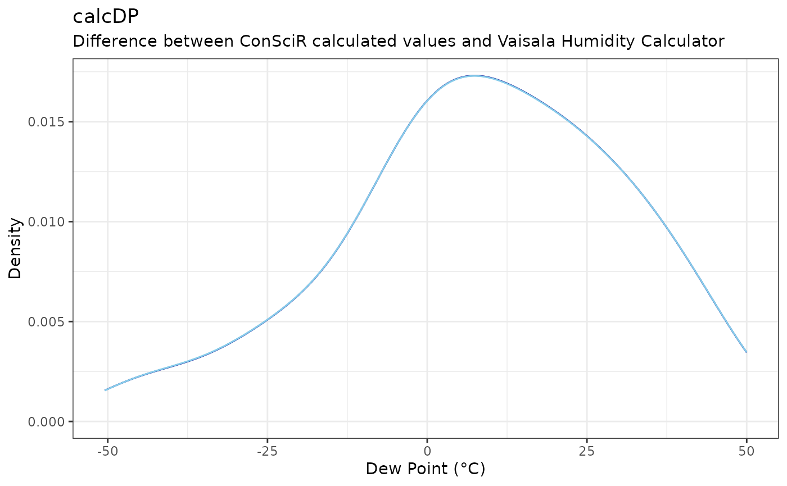

``` r

vaisala |>
  ggplot() +
  geom_density(aes(FP), color = "darkblue") +
  geom_density(aes(calcFP), color = "red") +
  labs(title = "calcFP - Function is unstable and under development", 
       x = "Frost Point (°C)", y = "Density",
       subtitle = "Difference between ConSciR calculated values and Vaisala Humidity Calculator") +
  theme_bw()
```

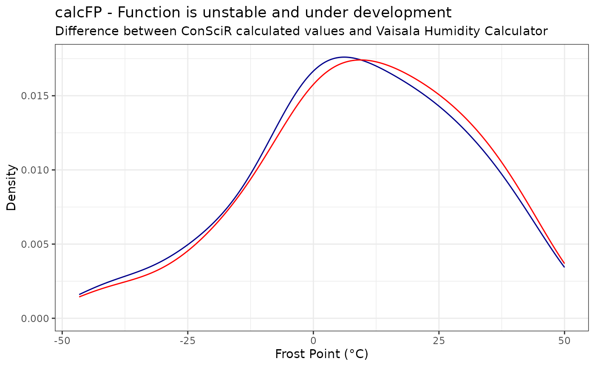

``` r

vaisala |>
  ggplot() +
  geom_density(aes(MR), color = "darkblue") +
  geom_density(aes(calcMR), alpha = 0.5, color = "skyblue") +
  labs(title = "calcMR", x = "Mixing Ratio (g/kg)", y = "Density",
       subtitle = "Difference between ConSciR calculated values and Vaisala Humidity Calculator") +
  theme_bw()
```

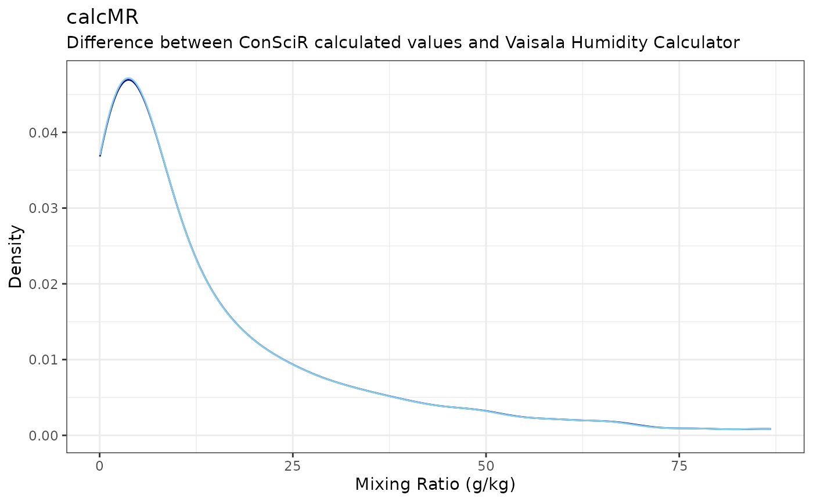

``` r

vaisala |>
  ggplot() +
  geom_density(aes(AD), color = "darkblue") +
  geom_density(aes(calcAD), alpha = 0.5, color = "skyblue") +
  labs(title = "calcAD", x = "Air Density (kg/m^3)", y = "Density",
       subtitle = "Difference between ConSciR calculated values and Vaisala Humidity Calculator") +
  theme_bw()
```

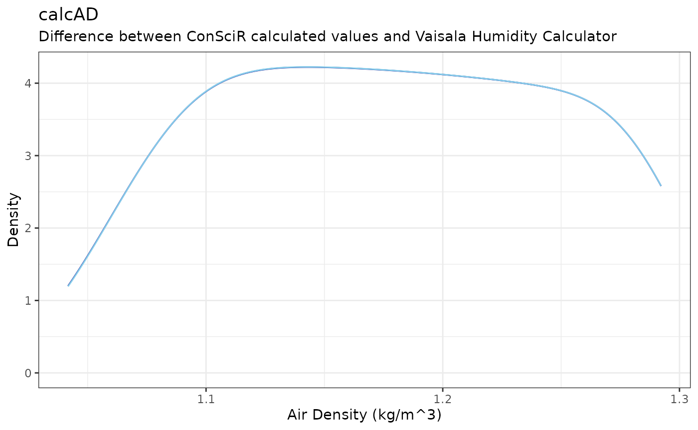

``` r

vaisala |>
  ggplot() +
  geom_density(aes(Enthalpy), color = "darkblue") +
  geom_density(aes(calcEnthalpy), alpha = 0.5, color = "skyblue") +
  labs(title = "calcEnthalpy", x = "Enthalpy (kJ/kg)", y = "Density",
       subtitle = "Difference between ConSciR calculated values and Vaisala Humidity Calculator") +
  theme_bw()
```

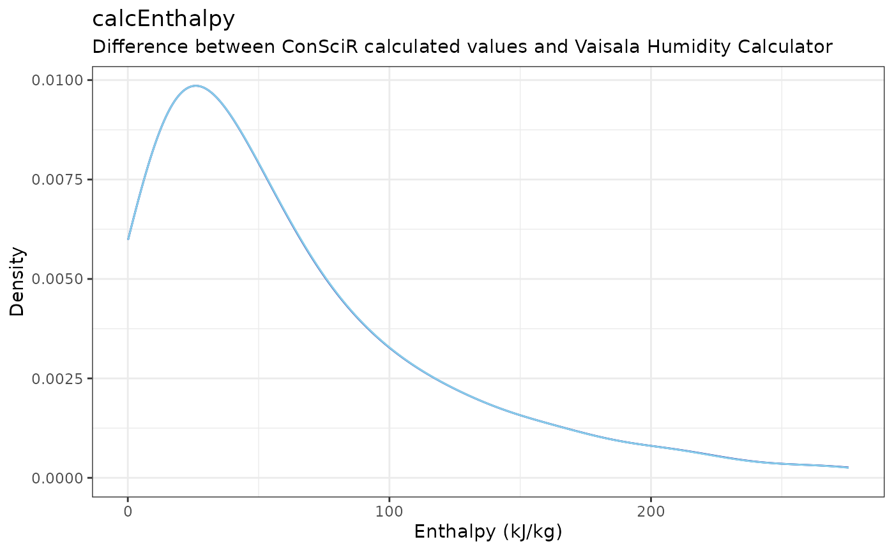
