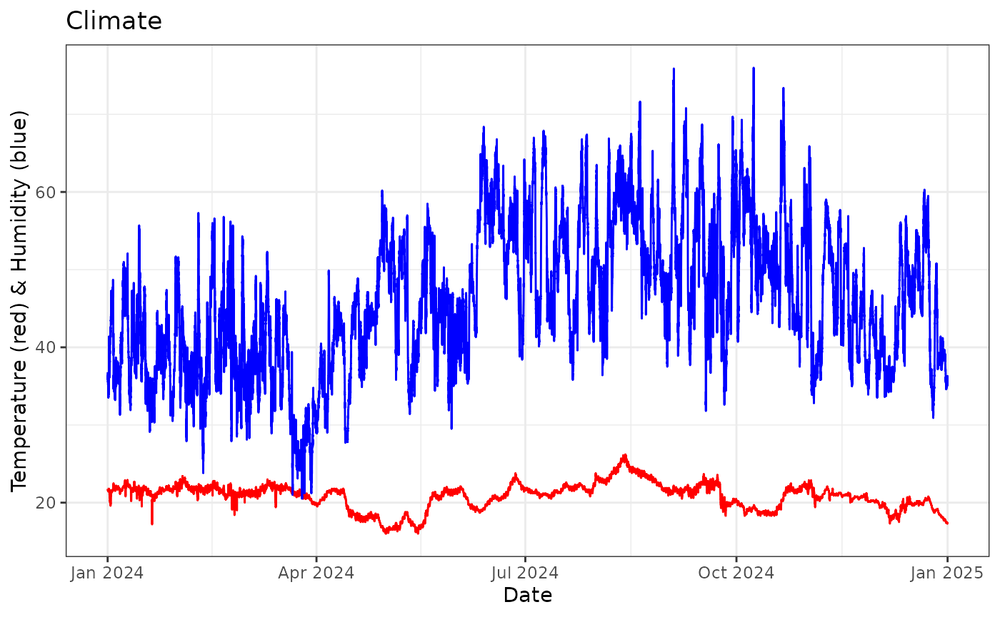
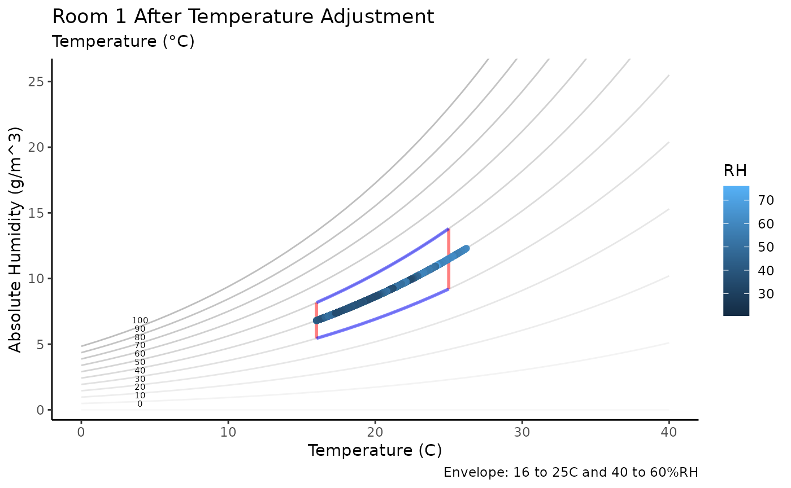
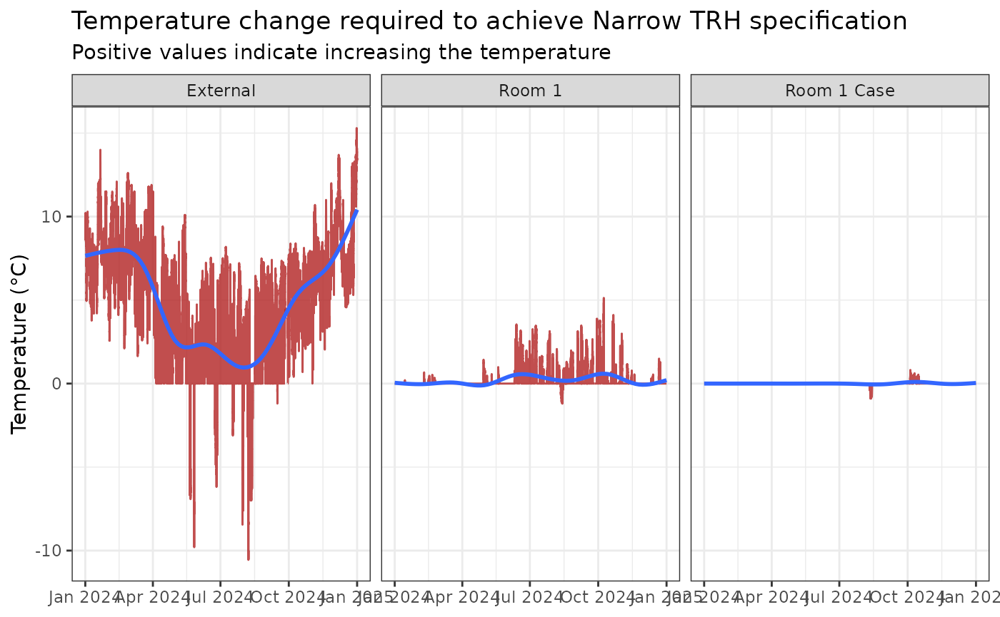
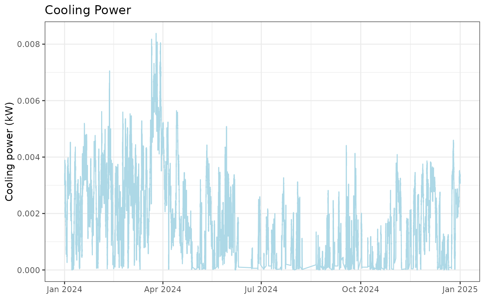
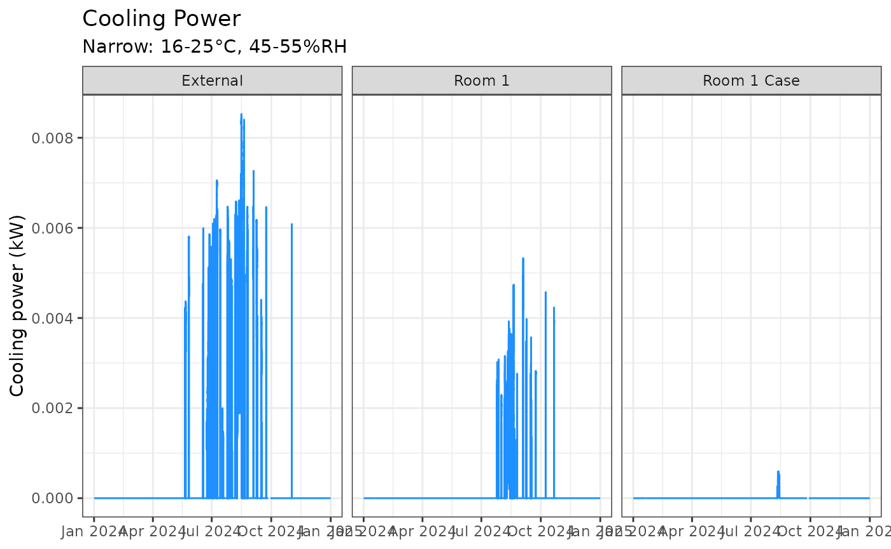
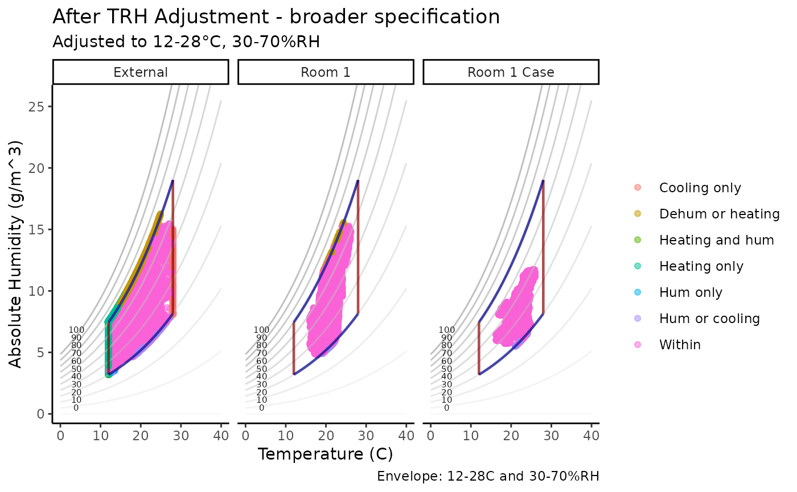
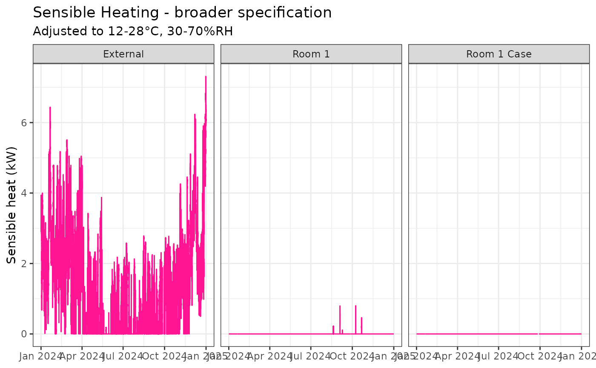
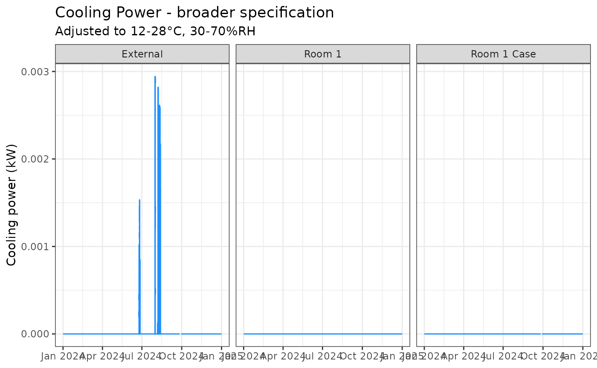
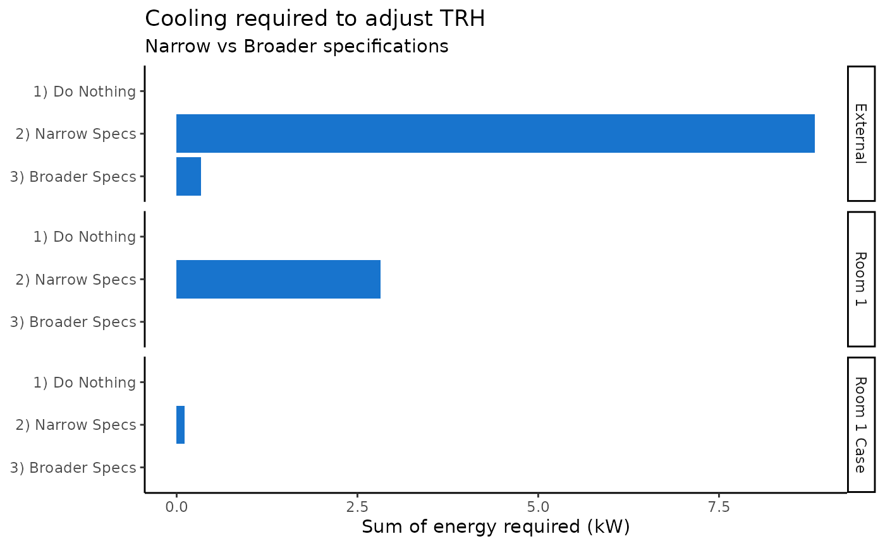
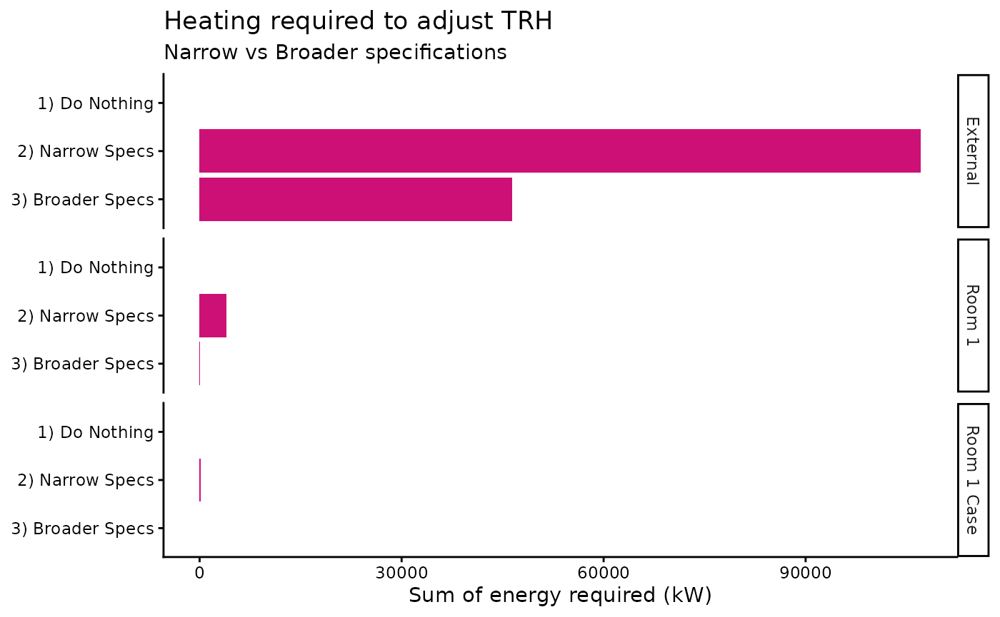

# Sustainability

``` r
library(ConSciR)
library(dplyr)
library(ggplot2)
library(forcats)
```

Cultural heritage organisations can reduce energy consumption by for
example broadening specifications that are used to manage risks to the
collections.

An example assessment of a space of theoretical reduction of energy by
broadening specifications from 16-25°C and 45-55%rh to 12-28°C and
30-70%rh. The increase/decrease of risks is also assessed using the
Conservation tools available in the package.

### Datasets

**mydata**

This dataset contains environmental monitoring data collected from
example heritage sites.

It includes measurements of temperature (°C) and relative humidity (%)
recorded by sensors over time.

| **Variable** | **Description**                               |
|:-------------|:----------------------------------------------|
| Site         | “London”                                      |
| Sensor       | “External”, “Room 1”, “Room 1 Case”           |
| Date         | Timestamp of the measurement (POSIXct format) |
| Temp         | Air temperature in degrees Celsius (°C)       |
| RH           | Relative humidity as percentage (0-100%)      |

Example usage to load the dataset from the package:

``` r
filepath <- data_file_path("mydata.xlsx")
mydata <- readxl::read_excel(filepath, sheet = "mydata")

head(mydata)
#> # A tibble: 6 × 5
#>   Site   Sensor Date                 Temp    RH
#>   <chr>  <chr>  <dttm>              <dbl> <dbl>
#> 1 London Room 1 2024-01-01 00:00:00  21.8  36.8
#> 2 London Room 1 2024-01-01 00:15:00  21.8  36.7
#> 3 London Room 1 2024-01-01 00:29:59  21.8  36.6
#> 4 London Room 1 2024-01-01 00:44:59  21.7  36.6
#> 5 London Room 1 2024-01-01 00:59:59  21.7  36.5
#> 6 London Room 1 2024-01-01 01:14:59  21.7  36.2

mydata |> graph_TRH() + theme_bw() + labs(title = "mydata") + facet_grid(~Sensor)
```


### Sustainability

Use the `add_humidity_adjustments` function to calculate how to adjust
the humidity in each space using the humidity funcitons.

The `add_humidity_adjustments` function applies humidity adjustment
calculations based on user-defined specifications for temperature and
RH. Adjusted variables like newTemp_TRHadj and newRH_TRHadj are the new
temperature and humidity values following heating, cooling,
humidification and dehumidification. An energy estimate is provided for
temperature adjustement (heating and coooling). Adjustment of humdity by
humidification and dehumidification is being developed.

``` r
mydata_adj <- 
  mydata |> 
  group_by(Sensor) |>
  add_humidity_adjustments(LowT = 16, HighT = 25, LowRH = 45, HighRH = 55) |>
  mutate(
    SensibleHeating = calcSensibleHeating(Temp, newTemp_TRHadj, RH, volumeFlowRate = 0.5),
    CoolingPower = calcCoolingPower(Temp, newTemp_TRHadj, RH, newRH_TRHadj, volumeFlowRate = 0.5)
  )

glimpse(mydata_adj)
#> Rows: 105,408
#> Columns: 38
#> Groups: Sensor [3]
#> $ Site            <chr> "London", "London", "London", "London", "London", "Lon…
#> $ Sensor          <chr> "Room 1", "Room 1", "Room 1", "Room 1", "Room 1", "Roo…
#> $ Date            <dttm> 2024-01-01 00:00:00, 2024-01-01 00:15:00, 2024-01-01 …
#> $ Temp            <dbl> 21.8, 21.8, 21.8, 21.7, 21.7, 21.7, 21.7, 21.7, 21.7, …
#> $ RH              <dbl> 36.8, 36.7, 36.6, 36.6, 36.5, 36.2, 36.3, 36.4, 36.0, …
#> $ AH              <dbl> 7.052415, 7.033251, 7.014087, 6.973723, 6.954670, 6.89…
#> $ DP              <dbl> 6.383970, 6.344456, 6.304848, 6.216205, 6.176529, 6.05…
#> $ TRH_within      <lgl> FALSE, FALSE, FALSE, FALSE, FALSE, FALSE, FALSE, FALSE…
#> $ T_lower         <lgl> FALSE, FALSE, FALSE, FALSE, FALSE, FALSE, FALSE, FALSE…
#> $ T_higher        <lgl> FALSE, FALSE, FALSE, FALSE, FALSE, FALSE, FALSE, FALSE…
#> $ RH_lower        <lgl> TRUE, TRUE, TRUE, TRUE, TRUE, TRUE, TRUE, TRUE, TRUE, …
#> $ RH_higher       <lgl> FALSE, FALSE, FALSE, FALSE, FALSE, FALSE, FALSE, FALSE…
#> $ zone            <chr> "Hum or cooling", "Hum or cooling", "Hum or cooling", …
#> $ TRH_zone        <chr> "Dry", "Dry", "Dry", "Dry", "Dry", "Dry", "Dry", "Dry"…
#> $ T_zone          <chr> "Within", "Within", "Within", "Within", "Within", "Wit…
#> $ RH_zone         <chr> "Dry", "Dry", "Dry", "Dry", "Dry", "Dry", "Dry", "Dry"…
#> $ dTemp           <dbl> 0, 0, 0, 0, 0, 0, 0, 0, 0, 0, 0, 0, 0, 0, 0, 0, 0, 0, …
#> $ dRH             <dbl> -8.2, -8.3, -8.4, -8.4, -8.5, -8.8, -8.7, -8.6, -9.0, …
#> $ newTemp_TRHadj  <dbl> 21.8, 21.8, 21.8, 21.7, 21.7, 21.7, 21.7, 21.7, 21.7, …
#> $ newAH_TRHadj    <dbl> 8.623877, 8.623877, 8.623877, 8.574250, 8.574250, 8.57…
#> $ dTemp_TRHadj    <dbl> 0, 0, 0, 0, 0, 0, 0, 0, 0, 0, 0, 0, 0, 0, 0, 0, 0, 0, …
#> $ dAH_TRHadj      <dbl> 1.571462, 1.590626, 1.609790, 1.600527, 1.619581, 1.67…
#> $ newRH_TRHadj    <dbl> 45, 45, 45, 45, 45, 45, 45, 45, 45, 45, 45, 45, 45, 45…
#> $ dRH_TRHadj      <dbl> 8.2, 8.3, 8.4, 8.4, 8.5, 8.8, 8.7, 8.6, 9.0, 9.0, 9.2,…
#> $ newAH_AHadj     <dbl> 8.623877, 8.623877, 8.623877, 8.574250, 8.574250, 8.57…
#> $ dAH_AHadj       <dbl> 1.571462, 1.590626, 1.609790, 1.600527, 1.619581, 1.67…
#> $ newRH_AHadj     <dbl> 45, 45, 45, 45, 45, 45, 45, 45, 45, 45, 45, 45, 45, 45…
#> $ dRH_AHadj       <dbl> 8.2, 8.3, 8.4, 8.4, 8.5, 8.8, 8.7, 8.6, 9.0, 9.0, 9.2,…
#> $ newTemp_AHadj   <dbl> 21.8, 21.8, 21.8, 21.7, 21.7, 21.7, 21.7, 21.7, 21.7, …
#> $ dTemp_AHadj     <dbl> 0, 0, 0, 0, 0, 0, 0, 0, 0, 0, 0, 0, 0, 0, 0, 0, 0, 0, …
#> $ newTemp_Tadj    <dbl> 18.54655, 18.50309, 18.45953, 18.36203, 18.31840, 18.1…
#> $ dTemp_Tadj      <dbl> -3.253447, -3.296908, -3.340472, -3.337966, -3.381603,…
#> $ newRH_Tadj      <dbl> 44.50688, 44.50032, 44.49374, 44.49407, 44.48749, 44.4…
#> $ dRH_Tadj        <dbl> 7.706876, 7.800316, 7.893740, 7.894074, 7.987487, 8.26…
#> $ newAH_Tadj      <dbl> 5.831209, 5.800415, 5.769701, 5.736456, 5.705996, 5.61…
#> $ dAH_Tadj        <dbl> -1.221207, -1.232836, -1.244386, -1.237268, -1.248673,…
#> $ SensibleHeating <dbl> 0, 0, 0, 0, 0, 0, 0, 0, 0, 0, 0, 0, 0, 0, 0, 0, 0, 0, …
#> $ CoolingPower    <dbl> 0, 0, 0, 0, 0, 0, 0, 0, 0, 0, 0, 0, 0, 0, 0, 0, 0, 0, …
```

Adjustment before and after applying calculations in the
`add_humidity_adjustments` function.

``` r
graph_psychrometric(mydata_adj, y_func = calcAH, data_col = "TRH_zone",
                    LowT = 16, HighT = 25, LowRH = 45, HighRH = 55) +  
  facet_wrap(~Sensor) + 
  labs(title = "Before TRH Adjustment", subtitle = "mydata", col = "") + 
  theme_classic()
```



``` r

mydata_adj |>
  graph_psychrometric(Temp = "newTemp_TRHadj", RH = "newRH_TRHadj", 
                      y_func = calcAH, data_col = "zone",
                      LowT = 16, HighT = 25, LowRH = 45, HighRH = 55) +
  labs(title = "After TRH Adjustment - narrow specification", 
       subtitle = "Adjusted to 16-25°C and 45-55%RH",
       col = "") +  
  facet_grid(~Sensor) + 
  theme_classic()
```



**Energy Implications**

The calculations of sensible heating and cooling power estimate the
energy required to condition heritage spaces to specified humidity and
temperature levels.

``` r

# Plot the temperature changes required to achieve target conditions 
mydata_adj |>
  ggplot() +
  geom_line(aes(Date, dTemp_TRHadj), col = "firebrick", alpha = 0.8) + 
  geom_smooth(aes(Date, dTemp_TRHadj)) + 
  labs(title = "Temperature change required to achieve Narrow TRH specification",
       subtitle = "Positive values indicate increasing the temperature",
       x = NULL, y = "Temperature (°C)") +
  facet_grid(~Sensor) + 
  theme_bw()
```



``` r

mydata_adj |>
  ggplot() +
  geom_line(aes(Date, SensibleHeating), col = "deeppink") + 
  labs(x = NULL, y = "Sensible heat (kW)", 
       title = "Sensible Heating", subtitle = "Narrow: 16-25°C, 45-55%RH") +
  facet_grid(~Sensor) + 
  theme_bw()
```



``` r
  
mydata_adj |>
  ggplot() +
  geom_line(aes(Date, CoolingPower), col = "dodgerblue") +
  labs(x = NULL, y = "Cooling power (kW)", 
       title = "Cooling Power", subtitle = "Narrow: 16-25°C, 45-55%RH") +
  facet_grid(~Sensor) + 
  theme_bw()
```



**Comparing Environmental Specifications**

Using broader or narrower environmental control specifications impacts
both energy consumption and heritage risks.

- Narrow specification: 16-25°C and 45-55%rh
- Broader specification: 12-28°C and 30-70%rh

``` r
mydata_adj2 <- 
  mydata |> 
  group_by(Sensor) |>
  add_humidity_adjustments(LowT = 12, HighT = 28, LowRH = 30, HighRH = 70) |>
  mutate(
    SensibleHeating = calcSensibleHeating(Temp, newTemp_TRHadj, RH, volumeFlowRate = 0.5),
    CoolingPower = calcCoolingPower(Temp, newTemp_TRHadj, RH, newRH_TRHadj, volumeFlowRate = 0.5)
  )

mydata_adj2 |>
  graph_psychrometric(Temp = "newTemp_TRHadj", RH = "newRH_TRHadj", 
                      y_func = calcAH, data_col = "zone",
                      LowT = 12, HighT = 28, LowRH = 30, HighRH = 70) +
  labs(title = "After TRH Adjustment - broader specification", 
       subtitle = "Adjusted to 12-28°C, 30-70%RH",
       col = "") +  
  facet_grid(~Sensor) + 
  theme_classic()
```



``` r
mydata_adj2 |>
  ggplot() +
  geom_line(aes(Date, SensibleHeating), col = "deeppink") + 
  labs(x = NULL, y = "Sensible heat (kW)", 
       title = "Sensible Heating - broader specification", subtitle = "Adjusted to 12-28°C, 30-70%RH") +
  facet_grid(~Sensor) + 
  theme_bw()
```



``` r
  
mydata_adj2 |>
  ggplot() +
  geom_line(aes(Date, CoolingPower), col = "dodgerblue") +
  labs(x = NULL, y = "Cooling power (kW)", 
       title = "Cooling Power - broader specification", subtitle = "Adjusted to 12-28°C, 30-70%RH") +
  facet_grid(~Sensor) + 
  theme_bw()
```



Combine datasets for comparison and add conservation risk metrics.

``` r
mydata_no_adj <- 
  mydata |>
  # Doing nothing costs no energy
  mutate(
    SensibleHeating = 0, CoolingPower = 0
  ) |>
  add_conservation_calcs()

mydata_adj <- 
  mydata_adj |>
  add_conservation_calcs(Temp = "newTemp_TRHadj", RH = "newRH_TRHadj")

mydata_adj2 <- 
  mydata_adj2 |>
  add_conservation_calcs(Temp = "newTemp_TRHadj", RH = "newRH_TRHadj")

mydata_bind <- 
  bind_rows(
    mydata_no_adj |> mutate(Specification = "1) Do Nothing"),
    mydata_adj |> mutate(Specification = "2) Narrow Specs"), 
    mydata_adj2 |> mutate(Specification = "3) Broader Specs")) 
```

Comparison of the risks and energy savings made by making the
specification broader.

``` r
mydata_bind |>
  ggplot() +
  geom_col(aes(fct_rev(Specification), CoolingPower), fill = "dodgerblue3") +
  coord_flip() +
  facet_grid(Sensor ~ .) + 
  labs(title = "Cooling required to adjust TRH", subtitle = "Narrow vs Broader specifications",
       x = NULL, y = "Sum of energy required (kW)") +
  theme_classic()
```



``` r

mydata_bind |>
  ggplot() +
  geom_col(aes(fct_rev(Specification), SensibleHeating), fill = "deeppink3") +
  coord_flip() +
  facet_grid(Sensor ~ .) + 
  labs(title = "Heating required to adjust TRH", subtitle = "Narrow vs Broader specifications",
       x = NULL, y = "Sum of energy required (kW)") + 
  theme_classic()
```



**Heritage Risk Indicators**

Summary metrics such as lifetime multiplier, preservation index,
equilibrium moisture content (EMC) of wood, and mould risk indices
provide a quantitative assessment of heritage risk under different
environmental control strategies.

- Lifetime multiplier - compared to 20°C and 50%rh, values \>1 are
  conditions prolong lifetime.
- Preservation index - years to deterioration, higher values are more
  favorable.
- Equilibrium moisture content wood between 6-20% - time spent within
  safer range (1 = 100%).
- Mould growth risk - lower values are better.

``` r
mydata_summary <- 
  mydata_bind |>
  group_by(Sensor, Specification) |>
  summarise(
    Lifetime = mean(Lifetime, na.rm = TRUE), 
    PreservationIndex = mean(PreservationIndex, na.rm = TRUE), 
    EMC_wood = mean(EMC_wood >= 6 & EMC_wood <= 20, na.rm = TRUE), 
    Mould_LIM = sum(RH > Mould_LIM, na.rm = TRUE),
    Mould_index = sum(Mould_index, na.rm = TRUE)
  )

mydata_summary
#> # A tibble: 9 × 7
#> # Groups:   Sensor [3]
#>   Sensor Specification Lifetime PreservationIndex EMC_wood Mould_LIM Mould_index
#>   <chr>  <chr>            <dbl>             <dbl>    <dbl>     <int>       <dbl>
#> 1 Exter… 1) Do Nothing    0.912              89.5    0.935      8497     141.   
#> 2 Exter… 2) Narrow Sp…    0.993              54.7    1         13122       0.953
#> 3 Exter… 3) Broader S…    0.952              72.5    1.000     11226      17.5  
#> 4 Room 1 1) Do Nothing    1.04               43.7    0.978         4       0.502
#> 5 Room 1 2) Narrow Sp…    1.01               39.3    1             6       0.157
#> 6 Room 1 3) Broader S…    1.04               43.5    1             6       0.465
#> 7 Room … 1) Do Nothing    1.07               42.1    0.971         0       0.140
#> 8 Room … 2) Narrow Sp…    1.02               37.3    1             0       0.135
#> 9 Room … 3) Broader S…    1.06               42.0    1             0       0.140
```

- The **“Do Nothing”** specification shows baseline risk levels and zero
  energy consumption. Mould risk are present but relatively high
  preservation indicators (ironically outdoors).
- The **“Narrow Specifications”** target tighter environmental ranges
  (e.g., 16-25°C and 45-55% RH). This tends to a slightly lower lifetime
  and preservation indices indoors than doing nothing. The risk of mould
  risk indoors decreases but there remains the question of the
  significance. Energy consumption is greater than “Do Nothing” and
  “Broader” specification.
- The **“Broader Specifications”** with a wider acceptable temperature
  and humidity range (e.g., 12-28°C and 30-70% RH) typically maintain
  similar lifetime multipliers and preservation indices as narrow ranges
  indoors. There is no energy consumption with no heating or cooling
  required indoors, however humidification/dehumidification are not
  considered (being developed). Mould risk remains similar to “Do
  Nothing”.

**Limitations: Research required**

Other conservation risk metrics not considered. For example, the
stress-strain behavior of materials which are more relevant to the
collections housed in a space.

Assumed that heating and cooling are 100% efficient and instantaneous.
The calculations based on the time-series stamped data are not
realistically managed at this rate. Establishing how spaces behave and
how fast and efficiently heating/cooling systems introduce heat and
cooling into a space needs to be established. Humidification and
dehumification energy consumption models also need to be developed.

Spaces are not typically conditioned directly from physical calculations
and other factors are needed to understand the energy consumption
(e.g. off-coil chiller dew point, chilled water temperature, etc.).
